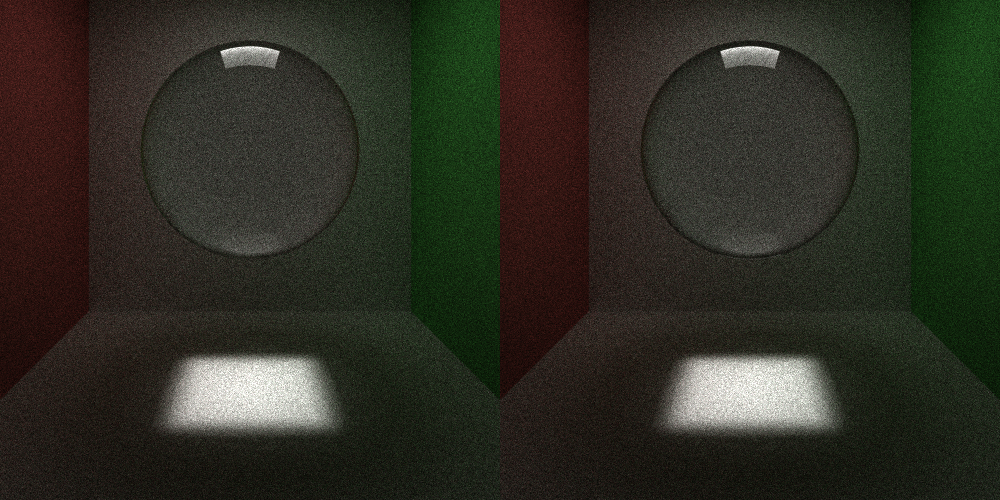
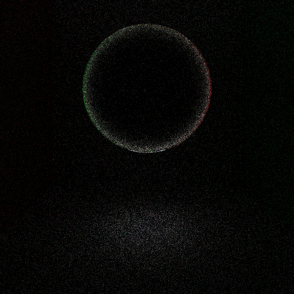

CUDA Path Tracer
================

**University of Pennsylvania, CIS 565: GPU Programming and Architecture, Project 3**

* (TODO) YOUR NAME HERE
* Tested on: (TODO) Windows 22, i7-2222 @ 2.22GHz 22GB, GTX 222 222MB (Moore 2222 Lab)

### (TODO: Your README)

*DO NOT* leave the README to the last minute! It is a crucial part of the
project, and we will not be able to grade you without a good README.


### Headless rendering
Render without a viewport
```
./build/bin/Release/cis565_path_tracer.exe scenes/cornell.json --headless --spp 100 --res 400x400 --out img/test/cornell.png
```

| Flag | Effect |
|---|---|
| `--headless` | No GLFW / ImGui / OpenGL. Render, save, exit. Prints total time and ms per sample. |
| `--spp N` | Override `ITERATIONS` from the scene file |
| `--res WxH` | Override `RES` from the scene file |
| `--out path.png` | Write exactly this file. Default is the usual `img/auto_saved/<FILE>.<time>.<spp>samp.png` |

The overrides also work in windowed mode. Output is deterministic, with same scene, spp and resolution produce a byte-identical PNG, so `cmp` against a previous render can be used to prove correctness for things that only improves performance but shouldn't alter the image at the same sample count.

### Issues along the way

Things that went wrong and what they turned out to be. Kept as a running log.

#### Schlick used the wrong cosine on exit

Schlick's approximation needs the cosine on the air side of the interface. Entering glass that is the incident angle. Leaving glass it is the transmitted angle, which the original code did not use. Real Fresnel reflectance hits 100% at the critical angle (about 42° for IOR 1.5), but with the incident cosine the curve did not get there until 90°, so exit rays just below critical leaked out instead of reflecting back inside. Fix: compute `k = 1 - eta²(1 - cos²θ)` yourself, use `sqrt(k)` as the Schlick cosine when `eta > 1`, and treat `k < 0` as total internal reflection.

Before (left) and after (right), 1000x1000, 500 spp, DEPTH 8:



Pixel difference, amplified 8x. The change is confined to the rim and the caustic under the sphere:



Notice that the fixed image is slightly *darker* at the rim. This is due to the fixed version keeps that light inside for more bounces, and with DEPTH 8 some of those longer paths hit the cap and get thrown away, in general this makes rays less likely to hit a light at the same depth. By changing the depth cap:

| Region | DEPTH 8 | DEPTH 32 |
|---|---|---|
| Sphere interior | 52.4 | 59.6 |
| Sphere rim | 40.4 | 44.7 |
| Floor caustic | 170.6 | 173.0 |
| Whole image | 25.3 | 27.8 |

We can see the depth cap was eating about 14% of the sphere's brightness on its own. The Schlick fix moved under 1%. This means glass materials needs a a lot higher depth than diffuse scenes. Honestly a surprise rabbit hole digging that landed this conclusion.
