CUDA Path Tracer
================

**University of Pennsylvania, CIS 565: GPU Programming and Architecture, Project 3**

* Yichen Huang
    - [LinkedIn](https://www.linkedin.com/in/yichen-huang-970b582bb/), [personal website](https://as7tesia.com/)
* Tested on: Windows 11, AMD Ryzen 5950X @ 4.3GHz (PBO Enabled), 64GB(3200 MT/s), RTX 3090 24GB

### Status

What works today, and what each missing piece needs before it can work. Last updated 2026-10-01.

#### glTF

A `.gltf` or `.glb` file loads in two ways: as the whole scene when it is the scene argument, or as a `"TYPE":"mesh"` object inside a scene JSON.

| Part | Works today |
|---|---|
| Geometry | Triangle lists with float positions, indexed or not. Normals come from the file, or are generated area-weighted when it has none. Tangents come from the file, or are generated with MikkTSpace when the primitive's material has a normal map. Node transforms as a matrix or as translation, rotation, scale. One instance per (node, primitive) pair |
| Camera | The first perspective camera in the node tree gives position, direction and `yfov`. A camera transform that mirrors flips the image. A file without a camera gets one that frames the scene's bounding sphere |
| Lights | Emissive surfaces: `emissiveFactor` times the emissive texture times `KHR_materials_emissive_strength`. An emitter also reflects through its BSDF |
| Materials | The glTF metallic-roughness BSDF with GGX microfacets (see [Materials](#materials-gltf-metallic-roughness)): base color, metallic, roughness, normal map, alpha mask, `KHR_materials_ior`, `_transmission`, `_volume` absorption, and the factors of `_specular` and `_clearcoat` |
| Textures | Base color, metallic-roughness, normal, emissive and transmission. PNG and JPEG, as files next to the glTF, data URIs or buffer views, decoded by tinygltf through stb_image. 16-bit images are converted to 8 bits per channel. Texture coordinates from `TEXCOORD_0`, wrap modes and the magnification filter from the sampler, no mipmaps. The texture unit decodes sRGB (base color, emissive) to linear before filtering |
| Render settings | glTF has none. Resolution and depth come from the flags, then from `extras.pbrt.render` when the file has it, then from the defaults (1024 high, depth 8). 5000 spp unless `--spp` is given |

| glTF feature | What happens today | Needs |
|---|---|---|
| Alpha blend | Rendered opaque: every Bistro material (the foliage) and Intel Sponza's `dirt_decal` | Alpha as coverage in the any-hit program that already handles alpha mask: the ray passes with probability 1 - alpha, from a random number both intersection paths can compute |
| One-sided emitters (`doubleSided` false) | An emitter emits from both faces | A front-face test on emission in the shade kernel |
| Environment light (PBRT infinite light in the research scenes) | Ignored, named on stderr | Environment lighting: radiance returned when a ray misses, from an HDRI map (`.exr`, `.pfm`) or a constant color |
| Punctual lights (`KHR_lights_punctual`), PBRT distant lights | Ignored, named on stderr | Direct light sampling (next event estimation). These lights have no surface for a path to hit |
| Scenes lit through a small opening (veach-ajar) | Mostly noise | Direct light sampling (next event estimation) |
| Camera roll | Dropped, with a note printed | An interactive camera that keeps its own up vector. The viewport camera always uses world +Y |

Of the 26 [glTF research scenes](https://github.com/ErfanMo77/gltf-research-scenes), 15 have an emissive surface and render with their glTF materials. The other 11 render black: 10 are lit by an environment light, and dragon by a distant light alone. cornell-caustic renders nearly black too, as it did with every material diffuse: its `extras.pbrt.render` names SPPM as the integrator.

Skipped by the loader, with no work planned: occlusion maps (they stand in for the shadowing a path tracer computes), the textures of `KHR_materials_specular` and `_clearcoat` (the clearcoat normal map among them), the thickness of `KHR_materials_volume`, sheen and the other `KHR_materials_*` extensions, vertex colors, texture coordinate sets after `TEXCOORD_0`, `KHR_texture_transform`. The loader names the extensions it skips, on the materials and on the texture slots it reads, and counts the blend materials on stderr.

### Viewport controls

The viewport navigates like the Unreal Engine 5 level editor: hold the right mouse button to look around and fly, or hold Alt for the Maya-style orbit. Any camera move restarts the accumulation.

| Input | Action |
|---|---|
| RMB drag | Look around in place |
| RMB + W / S | Fly forward / back |
| RMB + A / D | Fly left / right |
| RMB + E / Q | Fly up / down along world +Y |
| RMB + wheel | Fly speed up / down, x1.25 per notch (shown in the ImGui panel) |
| LMB drag | Up / down moves along the ground, left / right turns |
| MMB drag, or LMB + RMB drag | Pan |
| Wheel | Move forward / back in steps |
| Alt + LMB drag | Orbit around the pivot |
| Alt + RMB drag | Move toward / away from the pivot |
| Alt + MMB drag | Pan |
| F | Back to the scene file's camera |
| Ctrl + S | Save the image |
| Esc | Save the image and quit |

The ImGui panel also switches scenes without a restart. Its combo lists the scene JSONs in `scenes/` and the catalog's names (entries whose glTF is not downloaded are grayed out), and the field under it takes anything the command line takes: a name or a path to a .json, .gltf or .glb. The new scene is read first, so a bad file leaves the current scene in place with the error in the panel. On success the device buffers are rebuilt, the window takes the new scene's resolution, the camera starts at its scene camera and the accumulation starts over; `--res`, `--spp` and `--depth` from the command line still apply. The window is busy while a large scene loads (Intel Sponza takes a few seconds).

The camera is a position, a yaw about world +Y, a pitch that stops just short of straight up or down, and a pivot distance. The orbit pivot sits on the view axis at that distance and travels with the camera. It starts at the scene's `LOOKAT`, or for a glTF camera at a point on its view axis near the middle of the scene. The default fly speed crosses the scene's bounding box diagonal in 4 seconds. A drag hides and locks the cursor, so it does not stop at the edge of the screen. Headless renders build their basis from the same pose as the window's first frame.

### Headless rendering
Render without a viewport
```
./build/bin/Release/cis565_path_tracer.exe scenes/cornell.json --headless --spp 100 --res 400x400 --out img/test/cornell.png
```

The scene argument is a path, or a name: `cornell` is `scenes/cornell.json`, and `veach-mis` is the research scene of that name. Names other than the scene JSONs come from `scenes/catalog.json`, which maps a short name to each glTF scene under `scenes/assets` (the 26 research scenes in their extended variant, and the two Bistro files), so the files stay where their downloads put them. `--list` prints every name and marks the ones not downloaded.

| Flag | Effect |
|---|---|
| `--headless` | No GLFW / ImGui / OpenGL. Render, save, exit. Prints total time and ms per sample. |
| `--list` | Print the scene names and exit |
| `--spp N` | Override `ITERATIONS` from the scene file |
| `--res WxH` | Override `RES` from the scene file |
| `--depth N` | Override `DEPTH` from the scene file, the most rays a path may trace |
| `--out path.png` | Write exactly this file. Default is the usual `img/auto_saved/<FILE>.<time>.<spp>samp.png` |
| `--no-rr` | Disable Russian roulette |
| `--sort` | Sort paths by material before shading. Off by default since the [profile](PROFILING.md#the-material-sort); `--no-sort` is the default, kept for scripts |
| `--no-optix` | Intersect with the naive per-object kernel instead of the OptiX stage |
| `--optix-validate` | OptiX validation mode: checks every launch, slow |
| `--timing` | With `--headless`: print load, init and per-bounce stage times as CSV lines (see [PROFILING.md](PROFILING.md)) |
| `--tonemap none\|aces\|agx\|agx-punchy` | View transform for viewport and PNG. Default `agx-punchy`. `none` is the raw clamp the base code shipped with |
| `--exposure X` | Linear multiplier before the view transform. Default 1.0 |

The overrides also work in windowed mode. Output is deterministic, with same scene, spp, resolution and tonemap produce a byte-identical PNG, so `cmp` against a previous render can be used to prove correctness for things that only improves performance but shouldn't alter the image at the same sample count.

`tests/cmp_renders.sh` runs that check over 13 scenes (the JSON scenes, the textured and masked glTF ones, the three Khronos material tests and a research scene), both intersection paths, at 400x400 and 401x399. `golden` renders the set into `build/golden` before a change, `compare` renders it again after and cmps every PNG against its golden, and the exit code is nonzero when any of them differs.

### View transform

The accumulation buffer is scene-linear and never touched. Tonemapping is applied once at display and once at save, through the same function in `src/render/tonemap.h`, so the viewport and the PNG agree. Default is AgX punchy.

- **AgX** by Troy Sobotka, published as an OpenColorIO config: https://github.com/sobotka/AgX. The analytic version this project uses (inset/outset matrices, log2 shaper, polynomial sigmoid) is Benjamin Wrensch's "Minimal AgX Implementation": https://iolite-engine.com/blog_posts/minimal_agx_implementation. `agx-punchy` adds the "punchy" look from the same post, an ASC CDL grade (power 1.35, saturation 1.4) between the sigmoid and the outset matrix, matching the look of that name in Blender.
- **ACES**, two fits of the reference RRT+ODT, picked by the `ACES_FIT_HILL` macro in `tonemap.h`. Default is Krzysztof Narkowicz's single rational curve: https://knarkowicz.wordpress.com/2016/01/06/aces-filmic-tone-mapping-curve/. The alternative is Stephen Hill's fit with the sRGB to AP1 round trip, from `ACES.hlsl` in MJP's BakingLab: https://github.com/TheRealMJP/BakingLab/blob/master/BakingLab/ACES.hlsl. Hill's is scaled by 1/0.6 on input, same as three.js, so the two match in brightness. On Cornell they are within a few levels of each other once that's done.

Same accumulation buffer through each transform. Glass Cornell, 600x600, 1000 spp, exposure 1.0, DEPTH 8:

<!-- TODO: replace these four with the final hero shot through the same four transforms. Cornell has no saturated highlights, so the hue-skew difference between ACES and AgX barely shows here. -->

| ACES, Narkowicz fit | ACES, Hill fit (1/0.6) |
|:---:|:---:|
| 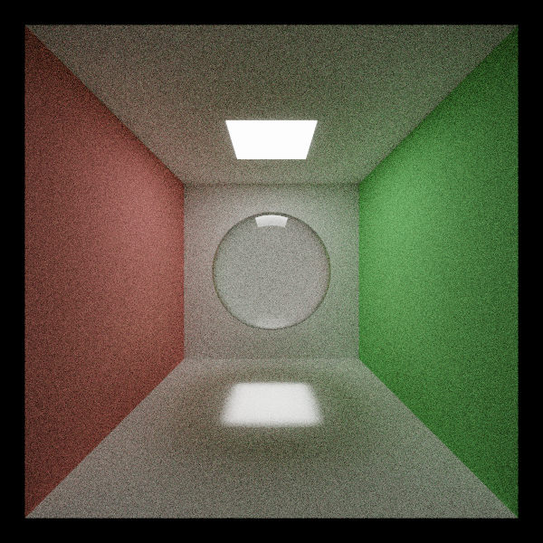 | 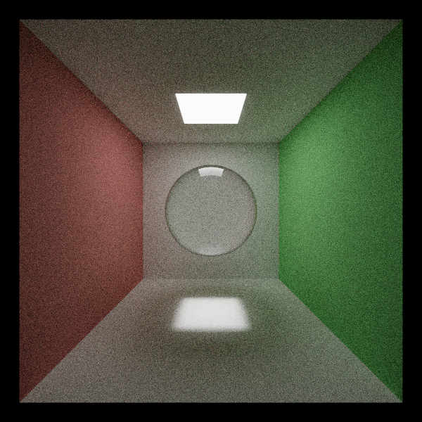 |
| **AgX** | **AgX punchy** |
| 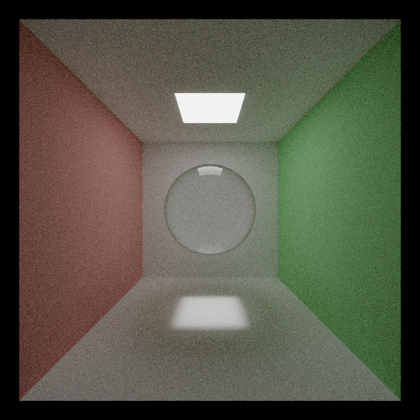 | 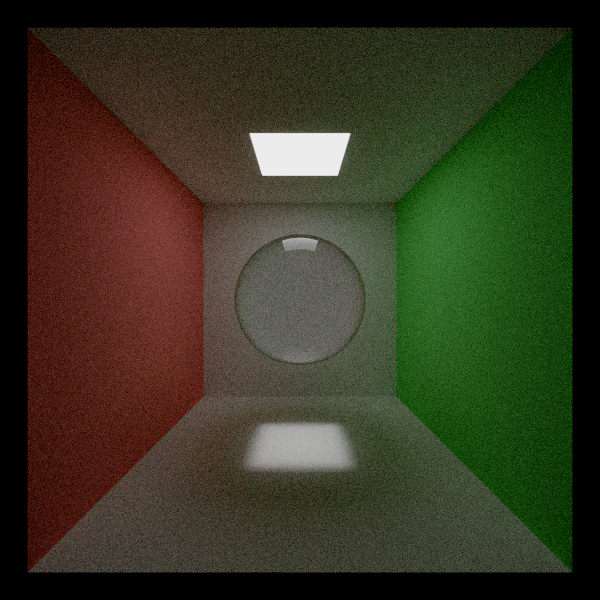 |

### Meshes: glTF loading

glTF files load through [tinygltf](https://github.com/syoyo/tinygltf) (v2.9.7, the last C++ header; v3 is a C rewrite). A scene object of `"TYPE":"mesh"` names the file, relative to the scene file's folder:

```json
{
    "TYPE":"mesh",
    "FILE":"assets/Duck/glTF/Duck.gltf",
    "MATERIAL":"glass",
    "TRANS":[0.0,-0.3,0.0], "ROTAT":[0.0,-25.0,0.0], "SCALE":[3.0,3.0,3.0]
}
```

The loader walks the file's default scene, multiplies node transforms down the tree, and makes one instance per (node, primitive) pair: the object's TRANS/ROTAT/SCALE times the node's world matrix. The positions, normals, texture coordinates, tangents and triangle indices of every primitive go into one flat array each on the `Scene`, read through the accessor's buffer view and stride, with a per-primitive record of where its triangles start. A primitive without normals gets area-weighted vertex normals, one without `TEXCOORD_0` gets (0, 0) at every vertex. A primitive without `TANGENT` whose material has a normal map gets tangents from [MikkTSpace](https://github.com/mmikk/MikkTSpace) (Morten S. Mikkelsen, zlib license, vendored in `external/mikktspace/`), the generator glTF names and the one normal maps are baked against; every other primitive gets zero tangents. `MATERIAL` is optional: without it the file's materials are appended to the scene's material list (see [Materials](#materials-gltf-metallic-roughness)).

Both intersection paths read the same arrays. The naive kernel loops over every triangle of every mesh instance in object space (two-sided Moller-Trumbore). OptiX builds one triangle GAS per primitive over the same buffers and one instance per scene object; its closest-hit program finds the triangle through a per-instance record and interpolates the vertex normal, uv and tangent from the barycentrics. Same conventions on both sides: the geometric normal decides `outside`, the shading normal is flipped to face the ray on a back-face hit, so refraction through a mesh works the same as through the built-in sphere.

Each image a material uses becomes a CUDA array of `uchar4`, and each (image, sampler, color space) a texture object over it (`src/render/textures.cpp`). The shade kernel samples each of a material's textures with `tex2D` at the hit's uv and multiplies the matching factor by it. Base color and emissive are stored sRGB-encoded, and the texture object's `sRGB` flag has the texture unit decode each texel to linear before the bilinear blend, so memory keeps the 8-bit sRGB values and the shader gets linear floats. A 16-bit image is rounded to 8 bits per channel at load. There are no mipmaps: the camera jitters each pixel's ray, so the samples already average the texels a pixel covers.

#### Test assets

Models come from [KhronosGroup/glTF-Sample-Assets](https://github.com/KhronosGroup/glTF-Sample-Assets), folder `Models/<name>/glTF/`, and are expected under `scenes/assets/<name>/glTF/`. The three material tests are the `.glb` files from `Models/<name>/glTF-Binary/`, under `scenes/assets/KhronosTests/`; they are made for environment lighting and have no light of their own, so their scene files add an emitting panel. That folder is gitignored. Each model needs its `.gltf`, `.bin` and the image files next to them. An image that is missing or cannot be used (a file that is not there, an image that only a KTX2 or WebP extension names) is a warning on stderr, and a base color slot that uses it renders magenta, so the broken asset shows in the render. The other slots fall back to their factor, since magenta in them would mean a mirror (metallic-roughness), a sideways normal or a surface that glows.

| model | triangles | scene file | credit |
|---|---|---|---|
| Box | 12 | `cornell_boxmesh.json` | Cesium, 2017, CC BY 4.0 |
| Duck | 4,212 | `cornell_duck.json` | Sony, 2006, SCEA Shared Source License 1.0 |
| Suzanne | 3,936 | `cornell_suzanne.json` | Norbert Nopper / UX3D, 2017, CC0 |
| DamagedHelmet | 15,452 | `cornell_helmet.json` | theblueturtle_, 2016, CC BY-NC 4.0; glTF rebuild by ctxwing, 2018, CC BY 4.0 |
| Sponza | 262,267 | `sponza.json` | Crytek (Frank Meinl), CryENGINE Limited License Agreement, glTF conversion from the Khronos repo |
| Intel Sponza, main and curtains | 3,747,018 + 1,997,366 | `sponza_intel.json` | Frank Meinl and Anton Kaplanyan, Intel, 2022, CC BY 4.0; curtains add-on by the Sponza Addon Package Crew |
| Bistro exterior | 2,829,226 | `assets/Bistro/Exterior/BistroExterior.gltf`, loaded directly | Amazon Lumberyard, July 2017, CC BY 4.0 |
| Bistro interior | 1,043,077 | `assets/Bistro/Interior/BistroInterior.gltf`, loaded directly | Amazon Lumberyard, July 2017, CC BY 4.0 |
| TransmissionRoughnessTest | 77,792 | `transmission_roughness.json` | Ed Mackey, Analytical Graphics, 2021, CC BY 4.0 |
| DragonAttenuation | 134,995 | `dragon_attenuation.json` | Dragon: Stanford Computer Graphics Laboratory, 1996, converted by Morgan McGuire, 2017, Stanford Graphics Library license; cloth backdrop: Adobe, CC0 |
| ClearCoatTest | 37,116 | `clearcoat.json` | Ed Mackey, Analytical Graphics, 2020, CC BY 4.0 |

The Intel Sponza comes from the [Intel Sample Library](https://www.intel.com/content/www/us/en/developer/topic-technology/graphics-processing-research/samples.html) as one zip per package. The glTF files, their `.bin` and `textures/` folders go under `scenes/assets/IntelSponza/<package>/`, keeping the zip's folder names (`main_sponza`, `pkg_a_curtains`, `pkg_d_10k_candles`). `sponza_intel.json` loads the main scene and the curtains package together, with the main file's first camera (`PhysCamera001`) and an emitting slab above the atrium in place of the sun, which is a punctual light. Cited as: Frank Meinl and Anton Kaplanyan, 2022, Intel Sample Library. The add-on packages also credit the Sponza Addon Package Crew: Katica Putica, Cristiano Siqueira, Timothy Heath, Justin Prazen, Sebastian Herholz, Bruce Cherniak, Anton Kaplanyan.

The Bistro comes from NVIDIA's Open Research Content Archive as FBX with DDS textures (`Bistro_v5_2.zip`), cited as: Amazon Lumberyard Bistro, Open Research Content Archive (ORCA). Amazon Lumberyard, July 2017. http://developer.nvidia.com/orca/amazon-lumberyard-bistro. I converted it with Blender 5.2.2: FBX import, then a glTF Separate export into `scenes/assets/Bistro/Exterior/` and `scenes/assets/Bistro/Interior/`, which writes every DDS texture out as PNG. Bistro's "Specular" texture packs occlusion, roughness and metalness into R, G and B, and the FBX importer wires it to Specular IOR Level, which exports as `KHR_materials_specular`. In the saved `.blend` files a Separate Color node sends G to Roughness and B to Metallic instead, so the export writes the same image as glTF's `metallicRoughnessTexture` (glTF reads roughness from G and metalness from B too). Every Bistro emitter has an emissive texture, and the scenes are otherwise lit by punctual lights and the sun, so both render dark until direct light sampling. Bistro's normal maps follow the DirectX convention (its README lists them as "Normal (DirectX)"), whose green channel points the opposite way from glTF's. They are loaded unchanged, so detail along the texture's v direction is lit inverted.

#### Naive loop vs OptiX by triangle count

1024x1024, ms per sample, median of 3 interleaved runs, GPU otherwise idle, from the [profiling sweep](PROFILING.md). `--no-optix` runs the naive kernel; the naive runs use 1 to 4 samples each because of how long they take.

| scene | triangles | depth | naive | OptiX |
|---|---|---|---|---|
| cornell (spheres and cubes, no mesh) | 0 | 8 | 8.41 | 8.63 |
| cornell-box (research scene) | 36 | 66 | 11.56 | 11.43 |
| cornell_helmet | 15,452 | 8 | 320 | 8.42 |
| transmission_roughness | 77,792 | 12 | 1,511 | 7.37 |
| dragon_attenuation | 134,995 | 16 | 3,146 | 7.52 |
| sponza | 262,267 | 8 | 5,553 | 10.20 |

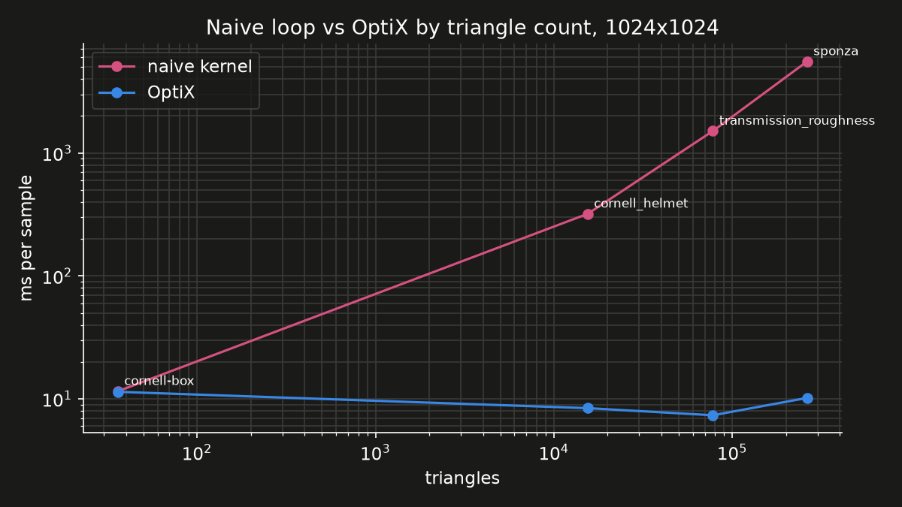

The naive kernel's time grows linearly with the triangle count, about 20 ms per sample per thousand triangles at this resolution, because every path tests every triangle of every instance at every bounce. OptiX stays within 15% of the Cornell frame time up to Sponza; Intel Sponza (5.7 million triangles) and Bistro (2.8 million) take 12.7 and 13.8 ms on OptiX and were not run on the naive kernel. The two analytic scenes come out even on both paths: with seven objects the naive loop is as cheap as a launch.

### Materials: glTF metallic-roughness

Every material, from a glTF file or a scene JSON, is one material model: the metallic-roughness BSDF from Appendix B of the glTF 2.0 spec, plus five `KHR_materials_*` extensions. The scene JSON format keeps its four material types, and the loader translates each into parameters of that model, starting from glTF's default material:

| JSON `TYPE` | Parameters |
|---|---|
| `Diffuse` | base color `RGB`, metallic 0, `specularFactor` 0: pure Lambert |
| `Emitting` | emission `RGB` x `EMITTANCE` over a black base with metallic 0 and `specularFactor` 0, which reflects nothing, so the path ends there |
| `Specular` | base color `RGB`, metallic 1, roughness `ROUGHNESS` (optional, default 0: a perfect mirror) |
| `Refractive` | base color `RGB`, transmission 1, ior `IOR`, roughness 0 |

The JSON types used to have their own scatter function, and two of them render differently now: the mirror brightens toward white at grazing angles (Fresnel with the base color as f0, instead of a flat tint), and glass tints only the refracted light, not the reflection. Every mirror and glass in the scene files is white or 0.98 white, so on them the change is mostly the noise pattern.

```
coated     = fresnel_coat(material, GGX(clearcoatRoughness^2))        KHR_materials_clearcoat
material   = mix(dielectric, metal, metallic)
metal      = GGX(roughness^2) with Schlick Fresnel, f0 = base color
dielectric = fresnel_mix(layer = GGX(roughness^2),
                         base  = mix(Lambert(base color), GGX transmission x base color, transmission))
```

The dielectric's f0 comes from `KHR_materials_ior` (1.5 by default, f0 = 0.04), times `specularColorFactor` and weighted by `specularFactor` from `KHR_materials_specular`. Per hit, `src/render/pbr_surface.h` reads the base color, metallic-roughness (roughness in G, metallic in B), normal, emissive and transmission (R) textures and multiplies each factor by its texture. The base color's alpha is read by the alpha test in the intersection stage instead.

#### Sampling

`scatterPbr` (`src/render/bsdf.cu`) picks one lobe per bounce and samples a direction from it. Microfacet normals come from the GGX distribution of normals visible from the outgoing direction (Dupuy and Benyoub 2023, spherical caps), so the D term and the Jacobian of the reflection or refraction cancel against the pdf, and a microfacet lobe's weight is its Fresnel term times the height-correlated Smith G2/G1. Roughness below 0.01 is a perfect mirror or a clean refraction.

| choice | picked with probability | sample weight |
|---|---|---|
| clearcoat or the rest | clearcoat x Fresnel(0.04, n·v) | G2/G1 |
| metal or dielectric | metallic | Fresnel(base color, v·h) x G2/G1 |
| glass or opaque dielectric | transmission | the chosen lobe's |
| glass: reflect or refract | Fresnel at the sampled microfacet | G2/G1, and x base color for refraction |
| opaque: specular layer or Lambert, p = layer / (layer + base) | layer: specularFactor x max Fresnel(n·v); base: max of the base color | layer: specularFactor x Fresnel(v·h) x G2/G1 / p; Lambert: base color x (1 - specularFactor x max Fresnel(v·h)) / (1 - p) |

Where the probability is the mixing weight itself, the weight cancels. The last row cannot do that, because the layer's Fresnel term depends on the sampled microfacet, so it picks with an estimate made from n·v and divides by it. The first version estimated the base as (1 - layer) x base color, which goes to 0 at grazing angles while the Fresnel term at a cosine-sampled half vector stays small, and the rare diffuse samples there got weights near 100. With the base color alone a diffuse weight stays below 2. A sample that ends on the wrong side of the surface (a normal map or a rough lobe can produce one) ends the path. The coat lobe exists on the air side only: inside a transmissive material (a back-face hit) the coat and the glass share an index, so the path sees no coat.

#### Transmission and absorption

Transmission is a solid boundary: the ray refracts through the ior on the way in and on the way out, with or without `KHR_materials_volume`. glTF reads a transmissive material without the volume extension as thin-walled, with no bending. I chose solid because 31 of the 34 glass materials in the research scenes have no volume extension and were converted from PBRT's solid dielectrics, and Blender exports glass without it. The volume extension adds absorption: a path that refracts into a surface records that material as the medium it is in, and until it refracts out again the shade kernel multiplies its throughput by exp(-σt) at every hit, whatever the hit lands on, with σ = -ln(attenuationColor) / attenuationDistance and t the length of the segment that just ended. The path keeps one medium: refracting out of an object nested inside another counts as leaving both. The base color tints every crossing of the boundary.

#### Emission

Emission is `emissiveFactor` x emissive texture x `emissiveStrength`. The shade kernel adds throughput x emission to the pixel at every hit and the path goes on, so an emitter also reflects. This is the only place light reaches the image: a path that ends (a miss, its last bounce, Russian roulette, a sample that carries no light) adds nothing. The clearcoat sits above the emission and darkens it by 1 - clearcoat x Fresnel(0.04, n·v), on the air side only like the coat lobe.

#### Normal maps

The tangent frame is the interpolated tangent made perpendicular to the normal, and the bitangent w x cross(N, T). It is built on the front-face normal, the side the map was authored for, and the mapped normal is flipped for a back-face hit. A mapped normal that faces away from the ray (a steep map at a grazing angle) falls back to the unmapped one. A mirroring instance transform flips w. The clearcoat lobe keeps the unmapped normal.

MikkTSpace takes v pointing up the image and glTF's v points down, so the loader hands it 1 - v. In Khronos Sponza, which ships its own `TANGENT`, 99.97% of the triangles have the bitangent pointing toward decreasing v, the direction this produces. Where MikkTSpace gives the corners of a shared vertex different tangents (a mirrored uv seam), the loader copies the vertex.

#### Alpha mask

A hit on a `MASK` material whose alpha (base color factor alpha x texture alpha) is below `alphaCutoff` does not count, and the ray goes on. OptiX runs an any-hit program for this on masked instances only: a mesh GAS keeps any-hit when one of its instances is masked, and the instance flag turns it off on the rest. The naive kernel makes the same test on every hit that would become the closest. The texture unit reads alpha linearly even from an sRGB texture (a texel of 128 reads 0.502 with the sRGB flag on, while its color reads 0.216). On a Sponza plant close-up the two paths differ by 0.15/255 on average.

#### Checking the BSDF

A host-side test (`tests/bsdf_test.cu`, the `bsdf_test` CMake target, outside the default build) runs `scatterPbr` two million times per case and compares the mean weight, which is the directional albedo, to a brute-force integral of the analytic BSDF over the sphere. Roughness 0.6, view angle 0.8 rad from the normal, red channel:

| material | sampled | integral |
|---|---|---|
| metal, base color (1, 0.7, 0.3) | 0.7941 | 0.7948 |
| opaque dielectric, base color (0.5, 0.8, 0.2) | 0.5147 | 0.5146 |
| the same with `specularFactor` 0 | 0.5000 | 0.4999 |
| glass, ior 1.5, white | 0.9615 | 0.9611 |
| metallic 0.4, transmission 0.3, `specularFactor` 0.7 | 0.8208 | 0.8210 |
| clearcoat 1 (roughness 0.3) over red plastic | 0.5347 | 0.5346 |

All 54 cases (six materials, roughness 0.3, 0.6 and 1, three view angles) agree within the noise of the integral. The test takes each estimate's standard error from its own samples and fails a case whose difference is more than 5 combined standard errors (the highest here is 2.1). The largest gaps, up to 0.008 for glass and metal at roughness 0.3, belong to the integral: with 16 times the samples it moves by as much (glass at 0.8 rad goes from 0.9895 to 0.9999, against 0.9975 sampled), since uniformly drawn directions rarely land in a narrow lobe. Two million random inputs, including grazing views and tilted shading normals, produce no NaN, infinite or negative weight. In the smooth limit the checks are exact: smooth metal returns the Schlick term in the mirror direction, and smooth white glass weighs every sample 1 and reflects the Fresnel share, all of it past the critical angle. The exit code is nonzero when any of the 58 checks fails.

The three Khronos material tests ship without lights, so their scene files add an emitting panel. 1024 spp, AgX.

| TransmissionRoughnessTest | DragonAttenuation |
|:---:|:---:|
| 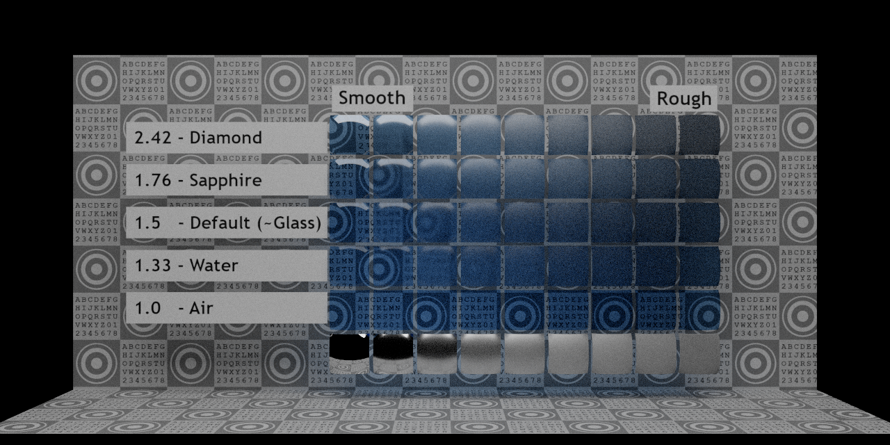 | 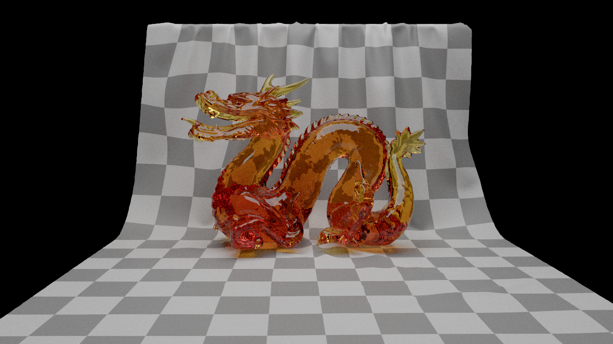 |
| **ClearCoatTest** | **DamagedHelmet** |
| 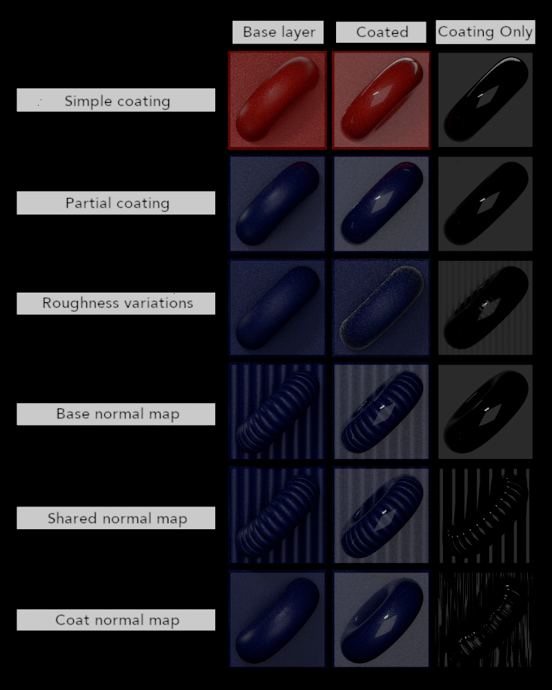 |  |

- **TransmissionRoughnessTest**: rows from ior 1.0 to 2.42, roughness growing to the right. The ior 1.0 row stays sharp at every roughness, since a microfacet cannot bend a ray that crosses no change in index, and the blur grows with the ior.
- **DragonAttenuation**: one absorption color and distance; the thin claws and spines come out pale yellow and the thick body deep orange.
- **ClearCoatTest**: the middle column combines the base layer's broad highlight (left) with the coating's sharp one (right). Four of its rows depend on clearcoat textures, which are not read, so their coat is uniform.
- **DamagedHelmet**: normal map (tangents from MikkTSpace), metallic-roughness map and the emissive lamps.

### Performance optimization

The full profile of the renderer, taken 2026-10-02 over eight scenes with per-stage timing, Nsight Systems and Nsight Compute, is in [PROFILING.md](PROFILING.md): where a sample goes, the material sort and Russian roulette toggles, the host synchronizations, kernel resources, per-hit work, load and init, the display path, and the before and after of the two defaults it changed (the material sort is now off, and the per-stage error checks are off in Release). The entry below is the earlier optimization it builds on.

#### Compaction and sort: thrust to CUB with device LTO

Measured 2026-09-25, before the glTF materials; the profile in PROFILING.md starts from this build.

**The first version used thrust.** Compaction was `thrust::stable_partition`, the sort was `thrust::sort_by_key` over the path and intersection arrays together, and a `finalGather` kernel added every path's color to the image after the bounce loop. It produced the right image and spent most of the frame outside the kernels; the "Issues along the way" entry below has the numbers.

**The current version uses CUB with a workspace allocated once.** All scratch memory (spare path and intersection buffers, the sort's index arrays, CUB's temporary storage) is allocated in `wavefrontInit` at the largest path count the loop can see, so nothing is allocated during a sample.

* Compaction is a CUB select of the live paths into the spare buffer, then a pointer swap. Terminated paths are dropped rather than moved to the back, which is why light goes into the image inside `shadeMaterial` (today at the hit that emits it, see [Emission](#emission)) and `finalGather` is gone.
* The sort no longer moves the path structs through every radix pass. It sorts (material key, path index) pairs over only the bits the material count needs (one pass for Cornell instead of four), then gathers paths and intersections into the spare buffers once.

Both operations are out of place and ping-pong: the caller's `dev_paths` and `dev_intersections` point at a different allocation after every call, and the old one becomes the spare.

| Before and after, one sample | Buffer ownership through one bounce |
|:---:|:---:|
| 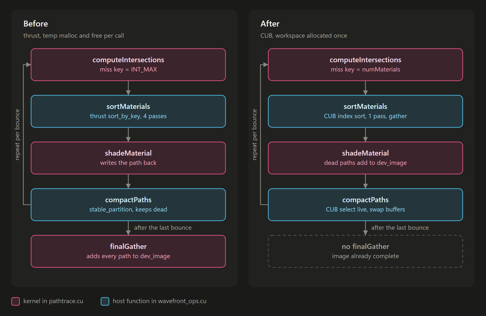 | 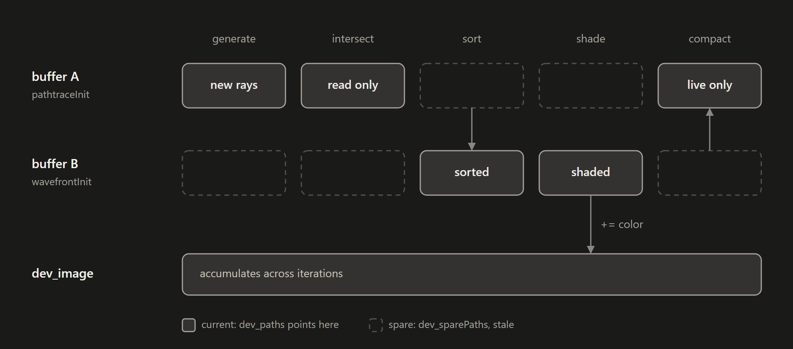 |

**Results.** Cornell, headless, `--tonemap none`, median of 5 interleaved runs per cell, GPU otherwise idle. Every build produces a byte-identical PNG at the same settings (checked with `cmp`), so the rows differ in time only.

| build | 400x400, 100 spp | 800x800, 50 spp | 1024x1024, 50 spp |
|---|---|---|---|
| thrust | 4.96 | 14.86 | 22.90 |
| thrust + LTO | 3.69 | 9.54 | 14.08 |
| CUB + LTO (current) | 0.64 | 1.38 | 2.07 |

Each cell is ms per sample.

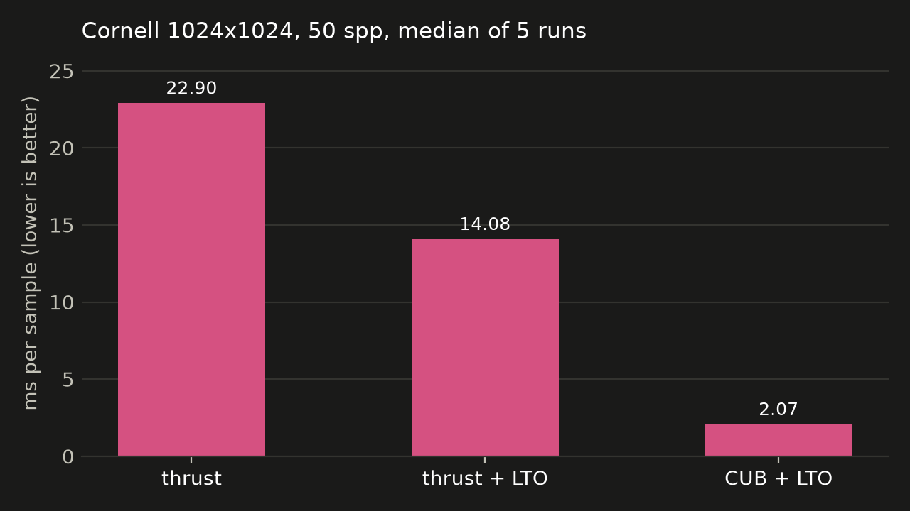

At 1024x1024 the frame went from 22.90 to 2.07 ms per sample, 11x. Device LTO is 1.6x of that on its own. The rest is the CUB rewrite: no allocation per call, no copy back, dead paths dropped instead of partitioned to the back.

### Issues along the way

Things that went wrong and what they turned out to be. Kept as a running log.

#### The OptiX cube kept the outward normal on exit hits

`boxIntersectionTest` returns the normal facing the ray on both entry and exit (on the exit face it stores the slab's entering normal, which points back inside). The OptiX cube hit program returned the face's outward normal in both cases. Nothing in Cornell starts a ray inside a wall, and the glass tests used the sphere, so the two paths agreed on every scene until the Box model test: a glass cube as a mesh rendered right on both paths, while the same cube as a scene cube came out dark under OptiX (mean 72 vs 78 of 255). The mesh hit program had been written with the flip, the cube one had not. One sign flip on the inside branch, and the cube scene matches the naive path to the same 4 levels as the mesh scenes.

600x600, 1000 spp, DEPTH 8, AgX, OptiX:

| Outward normal on exit | Normal facing the ray |
|:---:|:---:|
| 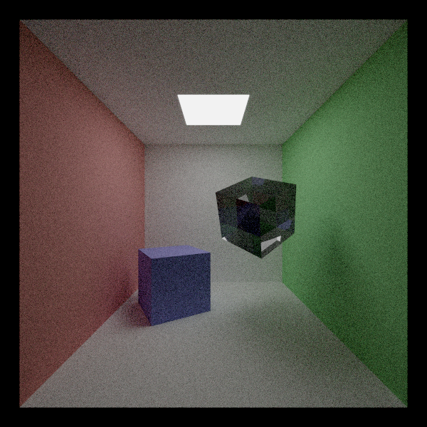 | 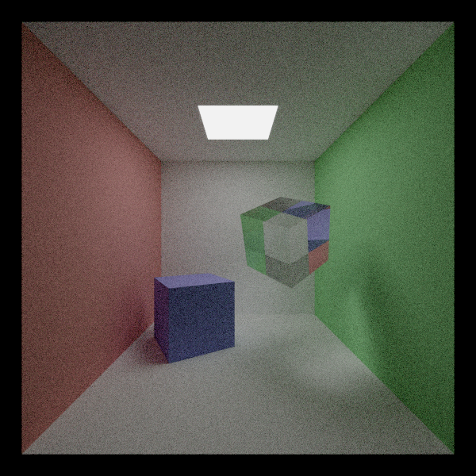 |

#### Schlick used the wrong cosine on exit

Schlick's approximation needs the cosine on the air side of the interface. Entering glass that is the incident angle. Leaving glass it is the transmitted angle, which the original code did not use. Real Fresnel reflectance hits 100% at the critical angle (about 42° for IOR 1.5), but with the incident cosine the curve did not get there until 90°, so exit rays just below critical leaked out instead of reflecting back inside. The fix computes `k = 1 - eta²(1 - cos²θ)` directly, uses `sqrt(k)` as the Schlick cosine when `eta > 1`, and treats `k < 0` as total internal reflection.

1000x1000, 500 spp, DEPTH 8, cropped to the sphere:

| Before | After |
|:---:|:---:|
| 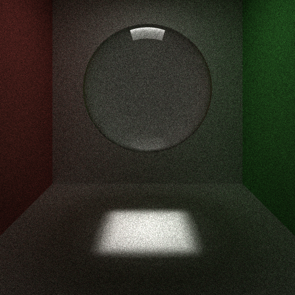 | 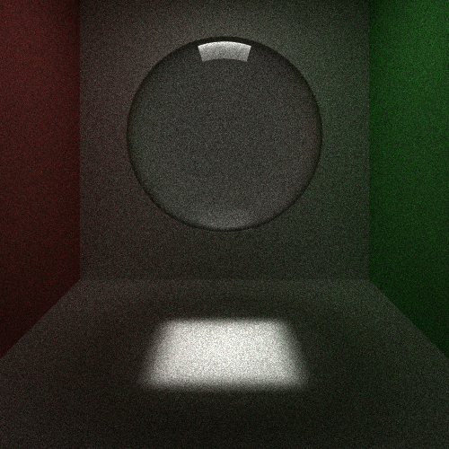 |

Pixel difference, amplified 8x. The change is confined to the rim and the caustic under the sphere:

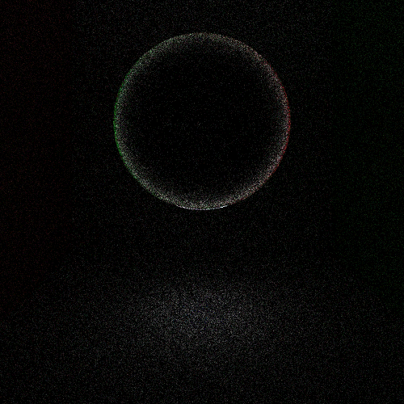

Notice that the fixed image is slightly *darker* at the rim. This is due to the fixed version keeps that light inside for more bounces, and with DEPTH 8 some of those longer paths hit the cap and get thrown away, in general this makes rays less likely to hit a light at the same depth. By changing the depth cap:

| Region | DEPTH 8 | DEPTH 32 |
|---|---|---|
| Sphere interior | 52.4 | 59.6 |
| Sphere rim | 40.4 | 44.7 |
| Floor caustic | 170.6 | 173.0 |
| Whole image | 25.3 | 27.8 |

We can see the depth cap was eating about 14% of the sphere's brightness on its own. The Schlick fix moved under 1%. This means glass materials needs a a lot higher depth than diffuse scenes. Honestly a surprise rabbit hole digging that landed this conclusion.

#### The sort and compaction were spending the frame in cudaMalloc

With the thrust version in, a 400x400 sample took 13 ms with the sort on and 5 ms with it off, and I assumed that was the sort itself. Timing each stage with CUDA events (Cornell 400x400, one sample, sort on, on the device LTO build so the kernels are at their real cost) said otherwise:

| stage | generate | intersect | sort | shade | compact | gather |
|---|---|---|---|---|---|---|
| ms | 0.08 | 0.36 | 8.9 | 0.21 | 4.0 | 0.03 |

The kernels add up to under 0.7 ms. The other 13 ms were in two thrust calls, for two reasons.

- Every thrust algorithm under the `thrust::device` policy allocates its scratch memory with `cudaMalloc` and frees it with `cudaFree` on the way out. `cudaFree` waits for all outstanding GPU work and `cudaMalloc` takes a device-wide lock. `stable_partition` is a composite (copy to a temporary, select the live paths to the front, write the dead ones to the back through a reverse iterator), each step with its own scratch, times eight bounces.
- `sort_by_key` over the zip iterator materializes the values into a temporary array of 68-byte tuples, radix-sorts 32-bit keys in four passes with every pass reading and writing every key and value, then copies back through the zip. Around 700 bytes of traffic per path per bounce, for a path that occupies 44 bytes.

Handing the same thrust calls a caching allocator (`thrust::cuda::par(alloc)`) removed 60 to 70% of both stages on its own, so that share was allocation. The rest was the copy-back and the extra passes, which is what the CUB version with a preallocated workspace and an index sort removes. Details and numbers in the performance section above.

#### Separable compilation left the intersection tests as real function calls

The base code's `CMakeLists.txt` sets `CUDA_SEPARABLE_COMPILATION ON`, which it needs so that `intersections.cu` and `interactions.cu` can be their own files. Without device link-time optimization, a `__device__` function defined in another file cannot be inlined into the kernel that calls it. `cuobjdump --dump-sass` on the exe showed `boxIntersectionTest`, `sphereIntersectionTest` and `scatterRay` as separate functions with `CALL.ABS` sites inside the kernels, and the call ABI shows up as local memory traffic:

| kernel | device calls | local memory instructions (STL/LDL) |
|---|---|---|
| `computeIntersections`, before | 3 | 72 |
| `shadeMaterial`, before | 4 | 38 |
| `computeIntersections`, with `-dlto` | 0 | 0 |
| `shadeMaterial`, with `-dlto` | 0 | 10 |

`Geom` is passed by value (three mat4), the output references need addresses, and the register copy of the path in `shadeMaterial` has to live in local memory because `scatterRay(PathSegment&)` takes its address across a call. So the "copy to registers, write back once" pattern in `shadeMaterial` was not happening at all.

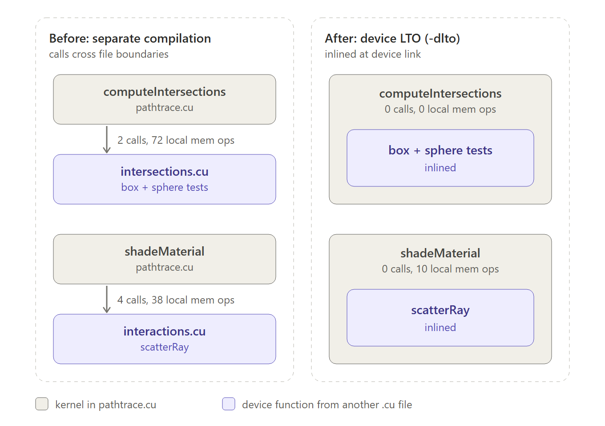

The fix is two lines in `CMakeLists.txt`: `-dlto` on the CUDA compile options and `$<DEVICE_LINK:-dlto>` on the device link options, Release only. Byte-identical image, and the no-sort frame got 25 to 40% faster depending on resolution, before any of the compaction work. The cost is at build time: the device link step takes about 4 s on every incremental build, since the inlining happens there.

#### The orbit camera mirrored any EYE off the z axis

The base code turns EYE into orbit angles with `acos`, which returns `[0, pi]` and drops the sign of x and of the pitch. So an eye at x = -4 was placed at x = +4 and an eye at height 8 ended up near the floor looking up. The rebuilt `right` and `up` were also not normalized (length cos(pitch)), which zoomed any pitched view in by 1/cos(pitch). The fix computes the angles from the eye's offset with `atan2`, normalizes the basis, and orders the loader so `view` exists before `right` is derived from it. Cornell's shipped camera sits on the z axis at lookAt height, the one spot where the old math was right, so its renders did not change.

400x400, 200 spp, AgX:

| EYE (-4, 5, 10.5) before | after | EYE (3, 8, 9) before | after |
|:---:|:---:|:---:|:---:|
| 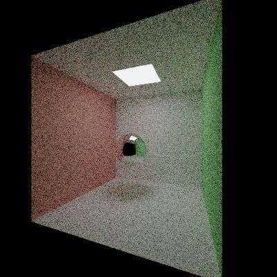 | 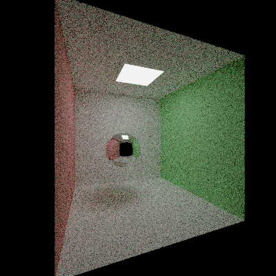 | 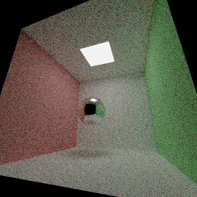 | 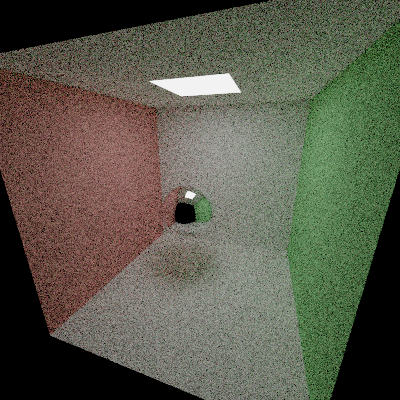 |

In the same pass, `FOVY` was being read as a half angle (`tan(fovy)` where `tan(fovy/2)` belongs), so 45 in the scene file was a 90 degree vertical field. The loader now takes the full angle and the scene files say 90, which renders the same image and stops the value from capping when matching a real lens or a glTF camera.

#### Intel Sponza's dirt decals rendered as solid walls

Intel Sponza's courtyard walls carry `dirt_decal`, the file's one `alphaMode: BLEND` material, on three decal meshes (one per floor) laid over the walls. Its texture is dark grime (mean 75 of 255) with alpha under 0.5 on 70% of its texels, and the material multiplies alpha by 0.35 on top, so the decals should cover about 12% of the wall on average. The loader treated BLEND as opaque, so the full dark texture covered the walls and the stone only showed in the gaps between decals, which looked like dark brown plaster with patches broken off.

The fix is just actually support alpha blending: a hit counts with probability alpha, and otherwise the ray goes on, in the same any-hit program and naive-kernel test that handle [alpha mask](#alpha-mask). The random number is a hash of the pixel, iteration, depth, instance and triangle, so both intersection paths make the same decision for the same hit, and OptiX gets the same answer when it calls any-hit more than once for a triangle.

1280x720, 256 spp, DEPTH 8, AgX, OptiX:

| BLEND as opaque | BLEND as coverage |
|:---:|:---:|
| 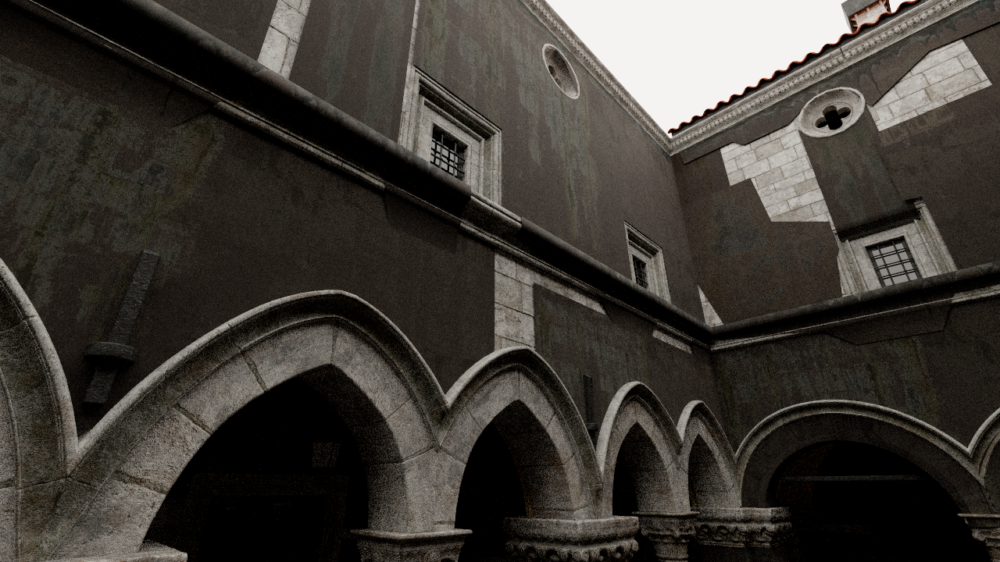 | 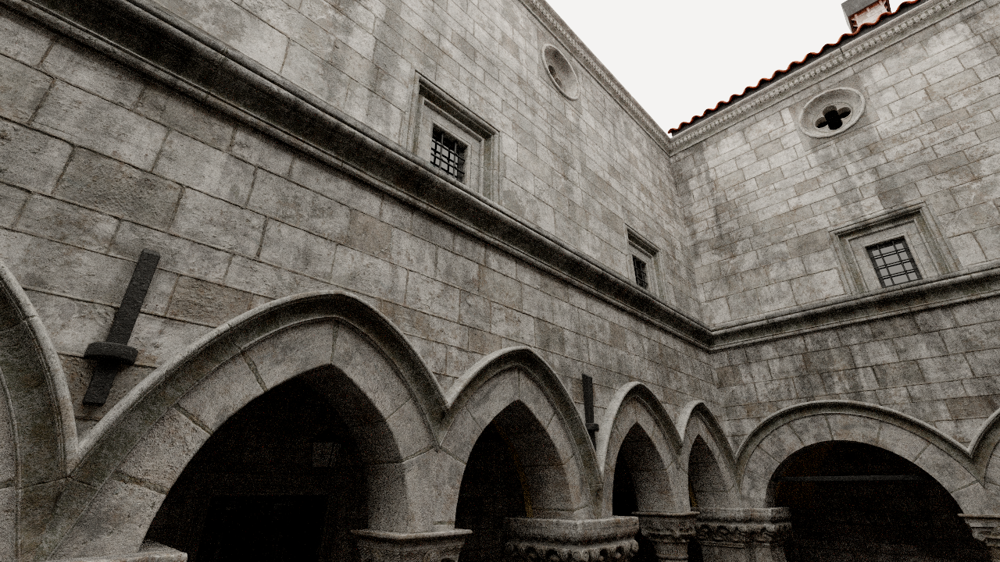 |

#### Smaller base code fixes

- **Every camera move freed and reallocated all device buffers.** A drag re-ran the full init per mouse event, about 2.8 ms at 800x800, more than a frame now costs. Buffers are allocated once; a camera change clears the image and resets the sample count.
- **The accumulation buffer was copied to the host every iteration** so the S key could save at any time. The copy now happens inside save.
- **A CUDA error waited on `getchar()` before exiting** on Windows, which hangs a headless run. Removed; the message goes to stderr either way.
