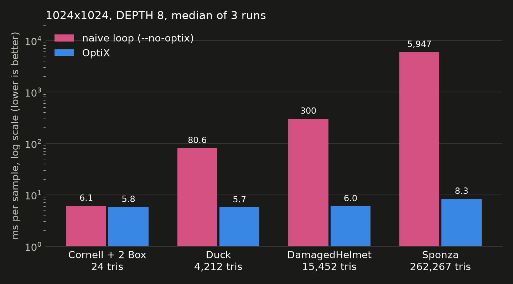

CUDA Path Tracer
================

**University of Pennsylvania, CIS 565: GPU Programming and Architecture, Project 3**

* Yichen Huang
    - [LinkedIn](https://www.linkedin.com/in/yichen-huang-970b582bb/), [personal website](https://as7tesia.com/)
* Tested on: Windows 11, AMD Ryzen 5950X @ 4.3GHz (PBO Enabled), 64GB(3200 MT/s), RTX 3090 24GB

### (TODO: Your README)

*DO NOT* leave the README to the last minute! It is a crucial part of the
project, and we will not be able to grade you without a good README.


### Status

What works today, and what each missing piece needs before it can work. Last updated 2026-09-28.

#### glTF

A `.gltf` or `.glb` file loads in two ways: as the whole scene when it is the scene argument, or as a `"TYPE":"mesh"` object inside a scene JSON.

| Part | Works today |
|---|---|
| Geometry | Triangle lists with float positions, indexed or not. Normals come from the file, or are generated area-weighted when it has none. Node transforms as a matrix or as translation, rotation, scale. One instance per (node, primitive) pair |
| Camera | The first perspective camera in the node tree gives position, direction and `yfov`. A camera transform that mirrors flips the image. A file without a camera gets one that frames the scene's bounding sphere |
| Lights | Emissive surfaces: `emissiveFactor` times `KHR_materials_emissive_strength` |
| Materials | Diffuse with the base color factor, or an emitter |
| Render settings | glTF has none. Resolution and depth come from the flags, then from `extras.pbrt.render` when the file has it, then from the defaults (1024 high, depth 8). 5000 spp unless `--spp` is given |

| glTF feature | What happens today | Needs |
|---|---|---|
| Base color texture | The base color factor is used alone, so textured scenes render white | Texture loading: image decoding, UVs carried through both intersection paths, textures on the GPU |
| Metallic and roughness | Ignored. Every surface that does not emit is diffuse | GGX microfacet BSDF with the glTF metallic-roughness layering. Texture loading for the metallic-roughness map |
| Normal map | Ignored | Texture loading, tangents (read from the file or generated), normal mapping in the shade kernel |
| Glass: `KHR_materials_transmission`, `_ior`, `_volume` | Rendered as opaque diffuse | Microfacet transmission (GGX BTDF) and Beer-Lambert absorption in the material model |
| Alpha mask | Ignored, masked surfaces are solid | Texture loading, and an any-hit program in OptiX with the same test in the naive kernel |
| Emitter that also reflects | An emitting material only emits, its base color is dropped | A material struct that carries emission next to the BSDF inputs. Today a material has one type, and the shade kernel ends the path at a light |
| Emissive texture | A material with one does not emit at all, since the factor alone would light the whole surface | Texture loading |
| One-sided emitters (`doubleSided` false) | An emitter emits from both faces | A front-face test on emission in the shade kernel |
| Environment light (PBRT infinite light in the research scenes) | Ignored, named on stderr | Environment lighting: radiance returned when a ray misses, from an HDRI map (`.exr`, `.pfm`) or a constant color |
| Punctual lights (`KHR_lights_punctual`), PBRT distant lights | Ignored, named on stderr | Direct light sampling (next event estimation). These lights have no surface for a path to hit |
| Scenes lit through a small opening (veach-ajar) | Mostly noise | Direct light sampling (next event estimation) |
| Camera roll | Dropped, with a note printed | An interactive camera that keeps its own up vector. The orbit camera always uses world +Y |

Of the 26 [glTF research scenes](https://github.com/ErfanMo77/gltf-research-scenes), 15 have an emissive surface and render, with every material diffuse. The other 11 render black: 10 are lit by an environment light, and dragon by a distant light alone.

Skipped by the loader, with no work planned: alpha blend, occlusion maps, clearcoat, sheen and the other `KHR_materials_*` extensions.

### Headless rendering
Render without a viewport
```
./build/bin/Release/cis565_path_tracer.exe scenes/cornell.json --headless --spp 100 --res 400x400 --out img/test/cornell.png
```

| Flag | Effect |
|---|---|
| `--headless` | No GLFW / ImGui / OpenGL. Render, save, exit. Prints total time and ms per sample. |
| `--spp N` | Override `ITERATIONS` from the scene file |
| `--res WxH` | Override `RES` from the scene file |
| `--out path.png` | Write exactly this file. Default is the usual `img/auto_saved/<FILE>.<time>.<spp>samp.png` |
| `--no-rr` | Disable Russian roulette |
| `--no-sort` | Disable the material sort before shading |
| `--no-optix` | Intersect with the naive per-object kernel instead of the OptiX stage |
| `--optix-validate` | OptiX validation mode: checks every launch, slow |
| `--tonemap none\|aces\|agx\|agx-punchy` | View transform for viewport and PNG. Default `agx`. `none` is the raw clamp the base code shipped with |
| `--exposure X` | Linear multiplier before the view transform. Default 1.0 |

The overrides also work in windowed mode. Output is deterministic, with same scene, spp, resolution and tonemap produce a byte-identical PNG, so `cmp` against a previous render can be used to prove correctness for things that only improves performance but shouldn't alter the image at the same sample count.

### View transform

The accumulation buffer is scene-linear and never touched. Tonemapping is applied once at display and once at save, through the same function in `src/tonemap.h`, so the viewport and the PNG agree. Default is AgX.

- **AgX** by Troy Sobotka, published as an OpenColorIO config: https://github.com/sobotka/AgX. The analytic version this project uses (inset/outset matrices, log2 shaper, polynomial sigmoid) is Benjamin Wrensch's "Minimal AgX Implementation": https://iolite-engine.com/blog_posts/minimal_agx_implementation. `agx-punchy` adds the "punchy" look from the same post, an ASC CDL grade (power 1.35, saturation 1.4) between the sigmoid and the outset matrix, matching the look of that name in Blender.
- **ACES**, two fits of the reference RRT+ODT, picked by the `ACES_FIT_HILL` macro in `tonemap.h`. Default is Krzysztof Narkowicz's single rational curve: https://knarkowicz.wordpress.com/2016/01/06/aces-filmic-tone-mapping-curve/. The alternative is Stephen Hill's fit with the sRGB to AP1 round trip, from `ACES.hlsl` in MJP's BakingLab: https://github.com/TheRealMJP/BakingLab/blob/master/BakingLab/ACES.hlsl. Hill's is scaled by 1/0.6 on input, same as three.js, so the two match in brightness. On Cornell they are within a few levels of each other once that's done.

Same accumulation buffer through each transform. Glass Cornell, 600x600, 1000 spp, exposure 1.0, DEPTH 8:

<!-- TODO: replace these four with the final hero shot through the same four transforms. Cornell has no saturated highlights, so the hue-skew difference between ACES and AgX barely shows here. -->

| ACES, Narkowicz fit | ACES, Hill fit (1/0.6) |
|:---:|:---:|
|  |  |
| **AgX** | **AgX punchy** |
|  |  |

### Meshes: glTF loading

glTF files load through [tinygltf](https://github.com/syoyo/tinygltf) (v2.9.7, the last C++ header; v3 is a C rewrite). A scene object of `"TYPE":"mesh"` names the file, relative to the scene file's folder:

```json
{
    "TYPE":"mesh",
    "FILE":"assets/Duck/glTF/Duck.gltf",
    "MATERIAL":"glass",
    "TRANS":[0.0,-0.3,0.0], "ROTAT":[0.0,-25.0,0.0], "SCALE":[3.0,3.0,3.0]
}
```

The loader walks the file's default scene, multiplies node transforms down the tree, and makes one instance per (node, primitive) pair: the object's TRANS/ROTAT/SCALE times the node's world matrix. The positions, normals and triangle indices of every primitive go into one flat array each on the `Scene`, read through the accessor's buffer view and stride, with a per-primitive record of where its triangles start. A primitive without normals gets area-weighted vertex normals. `MATERIAL` is optional: without it the file's materials are appended to the scene's material list as diffuse with the base color factor. Textures, metallic-roughness and tangents are not read yet.

Both intersection paths read the same arrays. The naive kernel loops over every triangle of every mesh instance in object space (two-sided Moller-Trumbore). OptiX builds one triangle GAS per primitive over the same buffers and one instance per scene object; its closest-hit program finds the triangle through a per-instance record and interpolates the vertex normal from the barycentrics. Same conventions on both sides: the geometric normal decides `outside`, the shading normal is flipped to face the ray on a back-face hit, so refraction through a mesh works the same as through the built-in sphere.

#### Test assets

Models come from [KhronosGroup/glTF-Sample-Assets](https://github.com/KhronosGroup/glTF-Sample-Assets), folder `Models/<name>/glTF/`, and are expected under `scenes/assets/<name>/glTF/`. That folder is gitignored; the `.gltf` and `.bin` are enough since textures are not read yet.

| model | triangles | scene file | credit |
|---|---|---|---|
| Box | 12 | `cornell_boxmesh.json` | Cesium, 2017, CC BY 4.0 |
| Duck | 4,212 | `cornell_duck.json` | Sony, 2006, SCEA Shared Source License 1.0 |
| Suzanne | 3,936 | `cornell_suzanne.json` | Norbert Nopper / UX3D, 2017, CC0 |
| DamagedHelmet | 15,452 | `cornell_helmet.json` | theblueturtle_, 2016, CC BY-NC 4.0; glTF rebuild by ctxwing, 2018, CC BY 4.0 |
| Sponza | 262,267 | `sponza.json` | Crytek (Frank Meinl), CryENGINE Limited License Agreement, glTF conversion from the Khronos repo |

#### Naive loop vs OptiX by triangle count

1024x1024, DEPTH 8, ms per sample, median of 3 runs, GPU otherwise idle. `--no-optix` runs the naive kernel.

| scene | triangles | naive | OptiX |
|---|---|---|---|
| Cornell with the two Box cubes | 24 | 6.07 | 5.76 |
| Duck | 4,212 | 80.6 | 5.67 |
| DamagedHelmet | 15,452 | 300.0 | 5.96 |
| Sponza | 262,267 | 5,947 | 8.30 |



The naive kernel's time grows linearly with the triangle count, about 20 ms per sample per thousand triangles at this resolution, because every path tests every triangle of every instance at every bounce. OptiX stays at the Cornell frame time until Sponza, where traversing 103 GASes in a scene with far more surface to bounce off adds 2.6 ms.

### Performance optimization

#### Compaction and sort: thrust to CUB with device LTO

TODO: Performance data of material sorting and stream compaction

**The first version used thrust.** Compaction was `thrust::stable_partition`, the sort was `thrust::sort_by_key` over the path and intersection arrays together, and a `finalGather` kernel added every path's color to the image after the bounce loop. It produced the right image and spent most of the frame outside the kernels; the "Issues along the way" entry below has the numbers.

**The current version uses CUB with a workspace allocated once.** All scratch memory (spare path and intersection buffers, the sort's index arrays, CUB's temporary storage) is allocated in `wavefrontInit` at the largest path count the loop can see, so nothing is allocated during a sample.

* Compaction is a CUB select of the live paths into the spare buffer, then a pointer swap. Terminated paths are dropped rather than moved to the back, which is why `shadeMaterial` now adds a path's color to the image at the moment it terminates and `finalGather` is gone.
* The sort no longer moves the path structs through every radix pass. It sorts (material key, path index) pairs over only the bits the material count needs (one pass for Cornell instead of four), then gathers paths and intersections into the spare buffers once.

Both operations are out of place and ping-pong: the caller's `dev_paths` and `dev_intersections` point at a different allocation after every call, and the old one becomes the spare.

| Before and after, one sample | Buffer ownership through one bounce |
|:---:|:---:|
|  |  |

**Results.** Cornell, headless, `--tonemap none`, median of 5 interleaved runs per cell, GPU otherwise idle. Every build produces a byte-identical PNG at the same settings (checked with `cmp`), so the rows differ in time only.

| build | 400x400, 100 spp | 800x800, 50 spp | 1024x1024, 50 spp |
|---|---|---|---|
| thrust | 4.96 | 14.86 | 22.90 |
| thrust + LTO | 3.69 | 9.54 | 14.08 |
| CUB + LTO (current) | 0.64 | 1.38 | 2.07 |

Each cell is ms per sample.


At 1024x1024 the frame went from 22.90 to 2.07 ms per sample, 11x. Device LTO is 1.6x of that on its own. The rest is the CUB rewrite: no allocation per call, no copy back, dead paths dropped instead of partitioned to the back.

### Issues along the way

Things that went wrong and what they turned out to be. Kept as a running log.

#### The OptiX cube kept the outward normal on exit hits

`boxIntersectionTest` returns the normal facing the ray on both entry and exit (on the exit face it stores the slab's entering normal, which points back inside). The OptiX cube hit program returned the face's outward normal in both cases. Nothing in Cornell starts a ray inside a wall, and the glass tests used the sphere, so the two paths agreed on every scene until the Box model test: a glass cube as a mesh rendered right on both paths, while the same cube as a scene cube came out dark under OptiX (mean 72 vs 78 of 255). The mesh hit program had been written with the flip, the cube one had not. One sign flip on the inside branch, and the cube scene matches the naive path to the same 4 levels as the mesh scenes.

600x600, 1000 spp, DEPTH 8, AgX, OptiX:

| Outward normal on exit | Normal facing the ray |
|:---:|:---:|
|  |  |

#### Schlick used the wrong cosine on exit

Schlick's approximation needs the cosine on the air side of the interface. Entering glass that is the incident angle. Leaving glass it is the transmitted angle, which the original code did not use. Real Fresnel reflectance hits 100% at the critical angle (about 42° for IOR 1.5), but with the incident cosine the curve did not get there until 90°, so exit rays just below critical leaked out instead of reflecting back inside. The fix computes `k = 1 - eta²(1 - cos²θ)` directly, uses `sqrt(k)` as the Schlick cosine when `eta > 1`, and treats `k < 0` as total internal reflection.

1000x1000, 500 spp, DEPTH 8, cropped to the sphere:

| Before | After |
|:---:|:---:|
|  |  |

Pixel difference, amplified 8x. The change is confined to the rim and the caustic under the sphere:


Notice that the fixed image is slightly *darker* at the rim. This is due to the fixed version keeps that light inside for more bounces, and with DEPTH 8 some of those longer paths hit the cap and get thrown away, in general this makes rays less likely to hit a light at the same depth. By changing the depth cap:

| Region | DEPTH 8 | DEPTH 32 |
|---|---|---|
| Sphere interior | 52.4 | 59.6 |
| Sphere rim | 40.4 | 44.7 |
| Floor caustic | 170.6 | 173.0 |
| Whole image | 25.3 | 27.8 |

We can see the depth cap was eating about 14% of the sphere's brightness on its own. The Schlick fix moved under 1%. This means glass materials needs a a lot higher depth than diffuse scenes. Honestly a surprise rabbit hole digging that landed this conclusion.

#### The sort and compaction were spending the frame in cudaMalloc

With the thrust version in, a 400x400 sample took 13 ms with the sort on and 5 ms with it off, and I assumed that was the sort itself. Timing each stage with CUDA events (Cornell 400x400, one sample, sort on, on the device LTO build so the kernels are at their real cost) said otherwise:

| stage | generate | intersect | sort | shade | compact | gather |
|---|---|---|---|---|---|---|
| ms | 0.08 | 0.36 | 8.9 | 0.21 | 4.0 | 0.03 |

The kernels add up to under 0.7 ms. The other 13 ms were in two thrust calls, for two reasons.

- Every thrust algorithm under the `thrust::device` policy allocates its scratch memory with `cudaMalloc` and frees it with `cudaFree` on the way out. `cudaFree` waits for all outstanding GPU work and `cudaMalloc` takes a device-wide lock. `stable_partition` is a composite (copy to a temporary, select the live paths to the front, write the dead ones to the back through a reverse iterator), each step with its own scratch, times eight bounces.
- `sort_by_key` over the zip iterator materializes the values into a temporary array of 68-byte tuples, radix-sorts 32-bit keys in four passes with every pass reading and writing every key and value, then copies back through the zip. Around 700 bytes of traffic per path per bounce, for a path that occupies 44 bytes.

Handing the same thrust calls a caching allocator (`thrust::cuda::par(alloc)`) removed 60 to 70% of both stages on its own, so that share was allocation. The rest was the copy-back and the extra passes, which is what the CUB version with a preallocated workspace and an index sort removes. Details and numbers in the performance section above.

#### Separable compilation left the intersection tests as real function calls

The base code's `CMakeLists.txt` sets `CUDA_SEPARABLE_COMPILATION ON`, which it needs so that `intersections.cu` and `interactions.cu` can be their own files. Without device link-time optimization, a `__device__` function defined in another file cannot be inlined into the kernel that calls it. `cuobjdump --dump-sass` on the exe showed `boxIntersectionTest`, `sphereIntersectionTest` and `scatterRay` as separate functions with `CALL.ABS` sites inside the kernels, and the call ABI shows up as local memory traffic:

| kernel | device calls | local memory instructions (STL/LDL) |
|---|---|---|
| `computeIntersections`, before | 3 | 72 |
| `shadeMaterial`, before | 4 | 38 |
| `computeIntersections`, with `-dlto` | 0 | 0 |
| `shadeMaterial`, with `-dlto` | 0 | 10 |

`Geom` is passed by value (three mat4), the output references need addresses, and the register copy of the path in `shadeMaterial` has to live in local memory because `scatterRay(PathSegment&)` takes its address across a call. So the "copy to registers, write back once" pattern in `shadeMaterial` was not happening at all.


The fix is two lines in `CMakeLists.txt`: `-dlto` on the CUDA compile options and `$<DEVICE_LINK:-dlto>` on the device link options, Release only. Byte-identical image, and the no-sort frame got 25 to 40% faster depending on resolution, before any of the compaction work. The cost is at build time: the device link step takes about 4 s on every incremental build, since the inlining happens there.

#### The orbit camera mirrored any EYE off the z axis

The base code turns EYE into orbit angles with `acos`, which returns `[0, pi]` and drops the sign of x and of the pitch. So an eye at x = -4 was placed at x = +4 and an eye at height 8 ended up near the floor looking up. The rebuilt `right` and `up` were also not normalized (length cos(pitch)), which zoomed any pitched view in by 1/cos(pitch). The fix computes the angles from the eye's offset with `atan2`, normalizes the basis, and orders the loader so `view` exists before `right` is derived from it. Cornell's shipped camera sits on the z axis at lookAt height, the one spot where the old math was right, so its renders did not change.

400x400, 200 spp, AgX:

| EYE (-4, 5, 10.5) before | after | EYE (3, 8, 9) before | after |
|:---:|:---:|:---:|:---:|
|  |  |  |  |

In the same pass, `FOVY` was being read as a half angle (`tan(fovy)` where `tan(fovy/2)` belongs), so 45 in the scene file was a 90 degree vertical field. The loader now takes the full angle and the scene files say 90, which renders the same image and stops the value from capping when matching a real lens or a glTF camera.

#### Smaller base code fixes

- **Every camera move freed and reallocated all device buffers.** A drag re-ran the full init per mouse event, about 2.8 ms at 800x800, more than a frame now costs. Buffers are allocated once; a camera change clears the image and resets the sample count.
- **The accumulation buffer was copied to the host every iteration** so the S key could save at any time. The copy now happens inside save.
- **A CUDA error waited on `getchar()` before exiting** on Windows, which hangs a headless run. Removed; the message goes to stderr either way.
