CUDA Path Tracer
================

**University of Pennsylvania, CIS 565: GPU Programming and Architecture, Project 3**

* Yichen Huang
    - [LinkedIn](https://www.linkedin.com/in/yichen-huang-970b582bb/), [personal website](https://as7tesia.com/)
* Tested on: Windows 11, AMD Ryzen 5950X @ 4.3GHz (PBO Enabled), 64GB(3200 MT/s), RTX 3090 24GB

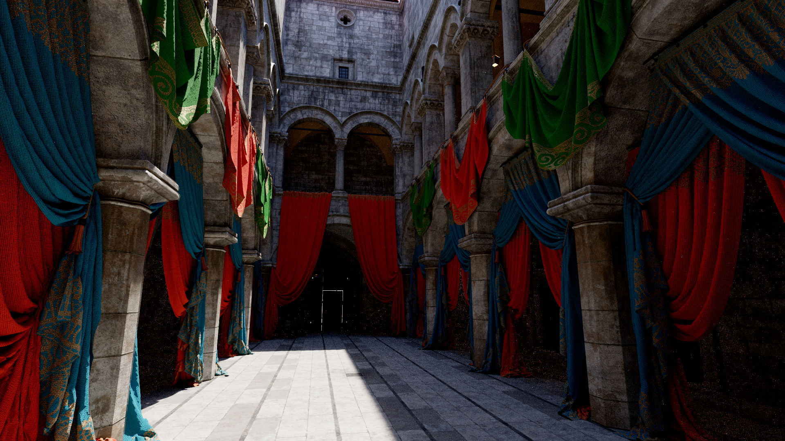

Intel Sponza with the curtains package, 1920x1080, 1024 spp, DEPTH 8, AgX punchy, no denoising, 12.5 s on the RTX 3090 (12.2 ms per sample).

### Rendering pipeline

The renderer is a wavefront path tracer: each stage of a bounce is one launch over every live path, and paths that end drop out between bounces. Intersection runs with OptiX hardware Ray Tracing (`--no-optix` flag disables OptiX and launches intersection kernels without NEE).

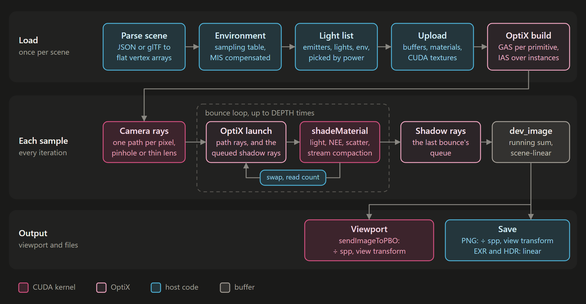

1. **Load**, once per scene: the scene JSON or glTF is parsed into flat vertex arrays and materials ([Meshes](#meshes-gltf-loading)), the environment map gets its sampling table ([Environment map sampling](#environment-map-sampling)), and every emitter goes into one light list weighted by power ([NEE and MIS](#nee-and-mis)). Buffers and textures are uploaded, and OptiX builds one GAS per glTF primitive and one IAS over the instances.
2. **Camera rays**: one path per pixel, through a random point in the pixel, from a pinhole or a thin lens.
3. **Bounce loop**, up to `DEPTH` times: an OptiX launch intersects the paths, `shadeMaterial` shades them, and the host swaps buffers and reads back how many paths are left (below).
4. **Last shadow rays**: the shadow rays still in the queue when the loop ends, traced in one more launch.
5. **Output**: `dev_image` holds the scene-linear sum of every sample. The viewport and the saved PNG divide it by the sample count and apply the [view transform](#view-transform); `.exr` and `.hdr` keep it linear.

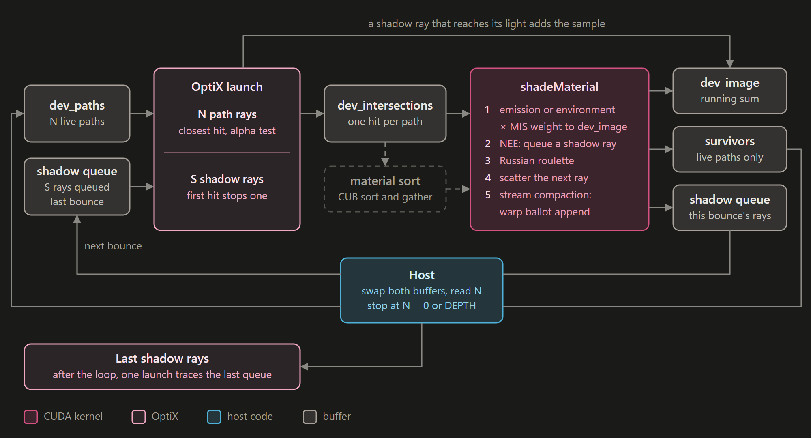

One bounce:

1. One OptiX launch traces two kinds of rays. Launch indices below N trace the N live paths to their closest hit, with the [alpha test](#alpha-mask), and write `dev_intersections`. The indices past N trace the S shadow rays the previous bounce queued, and a shadow ray that reaches its light adds the sample to `dev_image` in the miss program.
2. `shadeMaterial` runs one thread per path. It adds the emission at the hit, or the environment on a miss, weighted by MIS, picks a light and queues a shadow ray toward it ([NEE and MIS](#nee-and-mis)), runs Russian roulette, and samples the next direction from the BSDF ([Materials](#materials-gltf-metallic-roughness)).
3. Stream compaction happens inside `shadeMaterial`: paths that go on are written straight into the spare path buffer, a warp at a time with `__ballot_sync` and one `atomicAdd` ([Compaction moved into the shade kernel](#compaction-moved-into-the-shade-kernel)). A path that ended is not written anywhere, since its light is already in the image.
4. The host swaps both buffer pairs (paths and shadow queues), copies the survivor count N back, and starts the next bounce, until no path is left or `DEPTH` bounces have run.

The dashed box is the material sort (`--sort`), which groups the paths by material between intersection and shading. It is off by default (see [Performance optimization](#performance-optimization)).

### Meshes: glTF loading

glTF files load through [tinygltf](https://github.com/syoyo/tinygltf) (v2.9.7, the last C++ header; v3 is a C rewrite). A scene object of `"TYPE":"mesh"` names a `.gltf` or `.glb` by `FILE`, relative to the scene file, and places it with TRANS/ROTAT/SCALE; an optional `MATERIAL` replaces the file's own materials. The loader makes one instance per (node, primitive) pair and packs every primitive's vertices and indices into flat arrays on the `Scene`. Missing normals are generated from the triangles, and a normal-mapped primitive without `TANGENT` gets tangents from [MikkTSpace](https://github.com/mmikk/MikkTSpace) (Morten S. Mikkelsen, zlib license, vendored in `external/mikktspace/`).

The naive intersection kernel simply loops over every triangle of every mesh instance. OptiX builds one triangle GAS per primitive over the same buffers and one instance per scene object; its closest-hit program finds the triangle through a per-instance record and interpolates the vertex normal, uv and tangent from the barycentrics. Same conventions on both sides: the geometric normal decides `outside`, the shading normal is flipped to face the ray on a back-face hit, so refraction through a mesh works the same as through the built-in sphere.

Each image a material uses becomes a CUDA array of `uchar4`, and each (image, sampler, color space) a texture object over it (`src/render/textures.cpp`). The shade kernel samples each of a material's textures with `tex2D` at the hit's uv and multiplies the matching factor by it. Base color and emissive are stored sRGB-encoded, and the texture object's `sRGB` flag has the texture unit decode each texel to linear before the bilinear blend, so memory keeps the 8-bit sRGB values and the shader gets linear floats. A 16-bit image is rounded to 8 bits per channel at load. An image that is missing or cannot be used outputs warning to stderr, and a base color slot that uses it renders magenta, so the broken asset shows in the render. The other slots fall back to 1 on each channel.

#### Naive loop vs OptiX by triangle count

1024x1024, ms per sample, median of 3 interleaved runs, GPU otherwise idle, from the 2026-10-02 profiling sweep. `--no-optix` runs the naive kernel; the naive runs use 1 to 4 samples each because of how long they take.

| scene | triangles | depth | naive | OptiX |
|---|---|---|---|---|
| cornell (spheres and cubes, no mesh) | 0 | 8 | 8.41 | 8.63 |
| cornell-box (research scene) | 36 | 66 | 11.56 | 11.43 |
| cornell_helmet | 15,452 | 8 | 320 | 8.42 |
| transmission_roughness | 77,792 | 12 | 1,511 | 7.37 |
| dragon_attenuation | 134,995 | 16 | 3,146 | 7.52 |
| sponza | 262,267 | 8 | 5,553 | 10.20 |


The naive kernel's time grows linearly with the triangle count, about 20 ms per sample per thousand triangles at this resolution, because every path tests every triangle of every instance at every bounce. OptiX stays within 15% of the Cornell frame time up to Sponza; Intel Sponza (5.7 million triangles) and Bistro (2.8 million) take 12.7 and 13.8 ms on OptiX and were not run on the naive kernel. The two analytic scenes come out even on both paths: with seven objects the naive loop is as cheap as a launch.

### Materials: glTF metallic-roughness

Every material, from a glTF file or a scene JSON, is one material model: the metallic-roughness BSDF from Appendix B of the glTF 2.0 spec, plus five `KHR_materials_*` extensions. The scene JSON format keeps its four material types, and the loader translates each into parameters of that model, starting from glTF's default material:

| JSON `TYPE` | Parameters |
|---|---|
| `Diffuse` | base color `RGB`, metallic 0, `specularFactor` 0: pure Lambert |
| `Emitting` | emission `RGB` x `EMITTANCE` over a black base with metallic 0 and `specularFactor` 0, which reflects nothing, so the path ends there |
| `Specular` | base color `RGB`, metallic 1, roughness `ROUGHNESS` (optional, default 0: a perfect mirror) |
| `Refractive` | base color `RGB`, transmission 1, ior `IOR`, roughness 0 |

The JSON types used to have their own scatter function, and two of them render differently now: the mirror brightens toward white at grazing angles (Fresnel with the base color as f0, instead of a flat tint), and glass tints only the refracted light, not the reflection. Every mirror and glass in the scene files is white or 0.98 white, so on them the change is mostly the noise pattern.

```
coated     = fresnel_coat(material, GGX(clearcoatRoughness^2))        KHR_materials_clearcoat
material   = mix(dielectric, metal, metallic)
metal      = GGX(roughness^2) with Schlick Fresnel, f0 = base color
dielectric = fresnel_mix(layer = GGX(roughness^2),
                         base  = mix(Lambert(base color), GGX transmission x base color, transmission))
```

The dielectric's f0 comes from `KHR_materials_ior` (1.5 by default, f0 = 0.04), times `specularColorFactor` and weighted by `specularFactor` from `KHR_materials_specular`. Per hit, `src/render/pbr_surface.h` reads the base color, metallic-roughness (roughness in G, metallic in B), normal, emissive and transmission (R) textures and multiplies each factor by its texture. The base color's alpha is read by the alpha test in the intersection stage instead.

#### Sampling

`scatterPbr` (`src/render/bsdf.cu`) picks one lobe per bounce and samples a direction from it. Microfacet normals come from the GGX distribution of normals visible from the outgoing direction (Dupuy and Benyoub 2023, spherical caps), so the D term and the Jacobian of the reflection or refraction cancel against the pdf, and a microfacet lobe's weight is its Fresnel term times the height-correlated Smith G2/G1. Roughness below 0.01 is a perfect mirror or a clean refraction.

| choice | picked with probability | sample weight |
|---|---|---|
| clearcoat or the rest | clearcoat x Fresnel(0.04, n·v) | G2/G1 |
| metal or dielectric | metallic | Fresnel(base color, v·h) x G2/G1 |
| glass or opaque dielectric | transmission | the chosen lobe's |
| glass: reflect or refract | Fresnel at the sampled microfacet | G2/G1, and x base color for refraction |
| opaque: specular layer or Lambert, p = layer / (layer + base) | layer: specularFactor x max Fresnel(n·v); base: max of the base color | layer: specularFactor x Fresnel(v·h) x G2/G1 / p; Lambert: base color x (1 - specularFactor x max Fresnel(v·h)) / (1 - p) |

Where the probability is the mixing weight itself, the weight cancels. The last row cannot do that, because the layer's Fresnel term depends on the sampled microfacet, so it picks with an estimate made from n·v and divides by it. The first version estimated the base as (1 - layer) x base color, which goes to 0 at grazing angles while the Fresnel term at a cosine-sampled half vector stays small, and the rare diffuse samples there got weights near 100. With the base color alone a diffuse weight stays below 2. A sample that ends on the wrong side of the surface (a normal map or a rough lobe can produce one) ends the path. The coat lobe exists on the air side only: inside a transmissive material (a back-face hit) the coat and the glass share an index, so the path sees no coat.

#### Transmission and absorption

Transmission is a solid boundary: the ray refracts through the ior on the way in and on the way out, with or without `KHR_materials_volume`. glTF reads a transmissive material without the volume extension as thin-walled, with no bending. I chose solid because 31 of the 34 glass materials in the research scenes have no volume extension and were converted from PBRT's solid dielectrics, and Blender exports glass without it. The volume extension adds absorption: a path that refracts into a surface records that material as the medium it is in, and until it refracts out again the shade kernel multiplies its throughput by exp(-σt) at every hit, whatever the hit lands on, with σ = -ln(attenuationColor) / attenuationDistance and t the length of the segment that just ended. The path keeps one medium: refracting out of an object nested inside another counts as leaving both. The base color tints every crossing of the boundary.

#### Emission

Emission is `emissiveFactor` x emissive texture x `emissiveStrength`. The shade kernel adds throughput x emission to the pixel at every hit and the path goes on, so an emitter also reflects. With next event estimation on, that emission is weighed against the light samples (see NEE and MIS below). The clearcoat sits above the emission and darkens it by 1 - clearcoat x Fresnel(0.04, n·v), on the air side only like the coat lobe.

#### Normal maps

The tangent frame is the interpolated tangent made perpendicular to the normal, and the bitangent w x cross(N, T). It is built on the front-face normal, the side the map was authored for, and the mapped normal is flipped for a back-face hit. A mapped normal that faces away from the ray (a steep map at a grazing angle) falls back to the unmapped one. A mirroring instance transform flips w. The clearcoat lobe keeps the unmapped normal.

MikkTSpace takes v pointing up the image and glTF's v points down, so the loader hands it 1 - v. In Khronos Sponza, which ships its own `TANGENT`, 99.97% of the triangles have the bitangent pointing toward decreasing v, the direction this produces. Where MikkTSpace gives the corners of a shared vertex different tangents (a mirrored uv seam), the loader copies the vertex.

#### Alpha mask

A hit on a `MASK` material whose alpha (base color factor alpha x texture alpha) is below `alphaCutoff` does not count, and the ray goes on. OptiX runs an any-hit program for this on masked instances only: a mesh GAS keeps any-hit when one of its instances is masked, and the instance flag turns it off on the rest. The naive kernel makes the same test on every hit that would become the closest. The texture unit reads alpha linearly even from an sRGB texture (a texel of 128 reads 0.502 with the sRGB flag on, while its color reads 0.216). On a Sponza plant close-up the two paths differ by 0.15/255 on average.

#### Checking the BSDF

A host-side test (`tests/bsdf_test.cu`, the `bsdf_test` CMake target, outside the default build) runs `scatterPbr` two million times per case and compares the mean weight, which is the directional albedo, to a brute-force integral of the analytic BSDF over the sphere. Roughness 0.6, view angle 0.8 rad from the normal, red channel:

| material | sampled | integral |
|---|---|---|
| metal, base color (1, 0.7, 0.3) | 0.7941 | 0.7948 |
| opaque dielectric, base color (0.5, 0.8, 0.2) | 0.5147 | 0.5146 |
| the same with `specularFactor` 0 | 0.5000 | 0.4999 |
| glass, ior 1.5, white | 0.9615 | 0.9611 |
| metallic 0.4, transmission 0.3, `specularFactor` 0.7 | 0.8208 | 0.8210 |
| clearcoat 1 (roughness 0.3) over red plastic | 0.5347 | 0.5346 |

All 54 cases (six materials, roughness 0.3, 0.6 and 1, three view angles) agree within the noise of the integral. The test takes each estimate's standard error from its own samples and fails a case whose difference is more than 5 combined standard errors (the highest here is 2.1). The largest gaps, up to 0.008 for glass and metal at roughness 0.3, belong to the integral: with 16 times the samples it moves by as much (glass at 0.8 rad goes from 0.9895 to 0.9999, against 0.9975 sampled), since uniformly drawn directions rarely land in a narrow lobe. Two million random inputs, including grazing views and tilted shading normals, produce no NaN, infinite or negative weight. In the smooth limit the checks are exact: smooth metal returns the Schlick term in the mirror direction, and smooth white glass weighs every sample 1 and reflects the Fresnel share, all of it past the critical angle. The exit code is nonzero when any of the 58 checks fails.

The three Khronos material tests ship without lights, so their scene files add an emitting panel. 1024 spp, AgX.

| TransmissionRoughnessTest | DragonAttenuation |
|:---:|:---:|
|  |  |
| **ClearCoatTest** | **DamagedHelmet** |
|  |  |

- **TransmissionRoughnessTest**: rows from ior 1.0 to 2.42, roughness growing to the right. The ior 1.0 row stays sharp at every roughness, since a microfacet cannot bend a ray that crosses no change in index, and the blur grows with the ior.
- **DragonAttenuation**: one absorption color and distance; the thin claws and spines come out pale yellow and the thick body deep orange.
- **ClearCoatTest**: the middle column combines the base layer's broad highlight (left) with the coating's sharp one (right). Four of its rows depend on clearcoat textures, which are not read, so their coat is uniform.
- **DamagedHelmet**: normal map (tangents from MikkTSpace), metallic-roughness map and the emissive lamps.

### NEE and MIS

Without next event estimation, light reaches the image only when a path happens to hit an emitter or leaves the scene into the environment, so a small light is found by few paths and a point light by none. With it, every hit except a path's last also picks a point on a light and sends a shadow ray toward it. The two strategies then estimate the same direct light: the light sample, and a BSDF-sampled ray that hits the emitter. Multiple importance sampling (MIS) splits each direction's light between them with the power heuristic (Veach 1997), w = p² / (p² + p_other²), from the two strategies' densities for that direction. The two weights add up to 1, so every direction's light counts once.

Per hit, the shade kernel:

1. Adds the hit's emission x throughput x the BSDF side's weight. A camera ray, a ray from a smooth lobe and an emitter NEE does not sample keep weight 1, since no light sample could have taken that direction.
2. On every hit but the path's last, picks a light and a point on it, evaluates the BSDF toward it (`evalPbr`) and queues a shadow ray carrying throughput x f·cos x Le / p_light x w.
3. Runs Russian roulette, after the light sample as in PBRT, so a path that ends here still gets its direct light.
4. Samples the next direction (`scatterPbr`), which now also stores the BSDF's pdf for it in `PathSegment::pdf`, for step 1 at the next hit.

`--no-nee` and a checkbox in the viewport panel turn NEE off and leave BSDF sampling alone. NEE needs OptiX, since the OptiX launch traces the shadow rays, so `--no-optix` renders without it.

#### Lights and their pdf

At load, `src/scene/lights.cpp` builds one list of everything NEE can pick, each light with a probability proportional to its power:

| light | from | power |
|---|---|---|
| emissive triangle | glTF meshes, and scene JSON cubes as their 12 triangles | 2π x area x luminance(emission) |
| point light | `KHR_lights_punctual` | 4π x luminance(intensity) |
| distant light | `KHR_lights_punctual` directional lights, the research scenes' PBRT distant lights | π r² x luminance(irradiance), r the scene's bounding sphere |

Emitters glow from both sides, hence 2π, and a triangle's emission is its material's emission factor times its emissive texture's average color (see the last subsection). Emissive spheres stay out of the list, so a BSDF-sampled ray that hits one keeps all of its emission. The environment is in the list, see [the next section](#environment-map-sampling). glTF gives a point light's intensity in candela and a directional light's in lux, and the loader divides both by 683 lm/W to get back the radiant units Blender's exporter converts from (Bistro's files come from it). A floor under a 400 W point light (21,740.6 cd as the exporter writes it) and under a sun of strength 1 (683 lux) matches Cycles within 0.4%.

The shade kernel picks a light with a binary search over the running sum of the powers and a point on a triangle uniformly by area. The density of landing on a point of a triangle is then its pick probability over its area, 2π x luminance(emission) / total power: the area cancels, so it is one number per material. Over directions it becomes

```
p_light(ω) = (2π x luminance(emission) / total power) x d² / |cos θ_light|
```

with d the distance to the point and θ_light the angle at the light. A BSDF-sampled ray that hits an emitter computes the same value from its material id, its length t and the cosine at the hit. That cosine has to be the flat triangle's, as in the light sample, not the interpolated normal's, so the OptiX hit programs write it into `ShadeableIntersection::cosGeometric`. Point and distant lights are deltas, which no ray can hit, and their samples count with weight 1.

#### The BSDF side

`evalPbr` (`src/render/bsdf.cu`) returns f·cos and the pdf at a direction it did not pick, summed over the lobes with the probabilities `scatterPbr` picks them with. Those probabilities depend on the outgoing direction alone, so the mixture's pdf is exact. Smooth lobes (roughness below 0.01) add nothing to either, since they reflect or refract into one direction, which a light sample never lands on. Rough refraction needed a term that sampling never computes, because there D and the Jacobian cancel: the generalized half vector and its Jacobian from Walter et al. 2007. The BSDF test checks `evalPbr` three ways: f·cos against the analytic BSDF at random directions, the pdf integrated over the sphere against the share of samples `scatterPbr` keeps, and f·cos / pdf over `scatterPbr`'s own samples against their mean weight.

#### Shadow rays

`shadeMaterial` is a plain CUDA kernel and cannot call `optixTrace`, which only runs inside an OptiX launch. It queues each light sample as a shadow ray instead (origin, direction, a tMax just short of the light, the finished contribution, the pixel), with the same warp ballot and one atomicAdd per warp as the surviving paths. I chose to trace them in the next bounce's intersection launch rather than a launch of their own: launch indices below the path count trace path rays, the ones past it trace shadow rays. A shadow ray stops at the first hit it finds and runs no closest-hit program. The alpha any-hit still runs, with a seed of its own, so cut-outs let light through. A shadow ray that reaches tMax has nothing in its way, and its miss program adds the contribution to the pixel. The launch is as wide as the number of paths that queued rays, a bound the host already has, and raygen reads the real count from device memory, so a bounce still reads back only the survivor count. After the last bounce, one launch traces the queue that is left.

#### Comparisons

Veach MIS, 1024x1024, 64 spp, AgX, OptiX.

| BSDF sampling only | NEE + MIS |
|:---:|:---:|
| 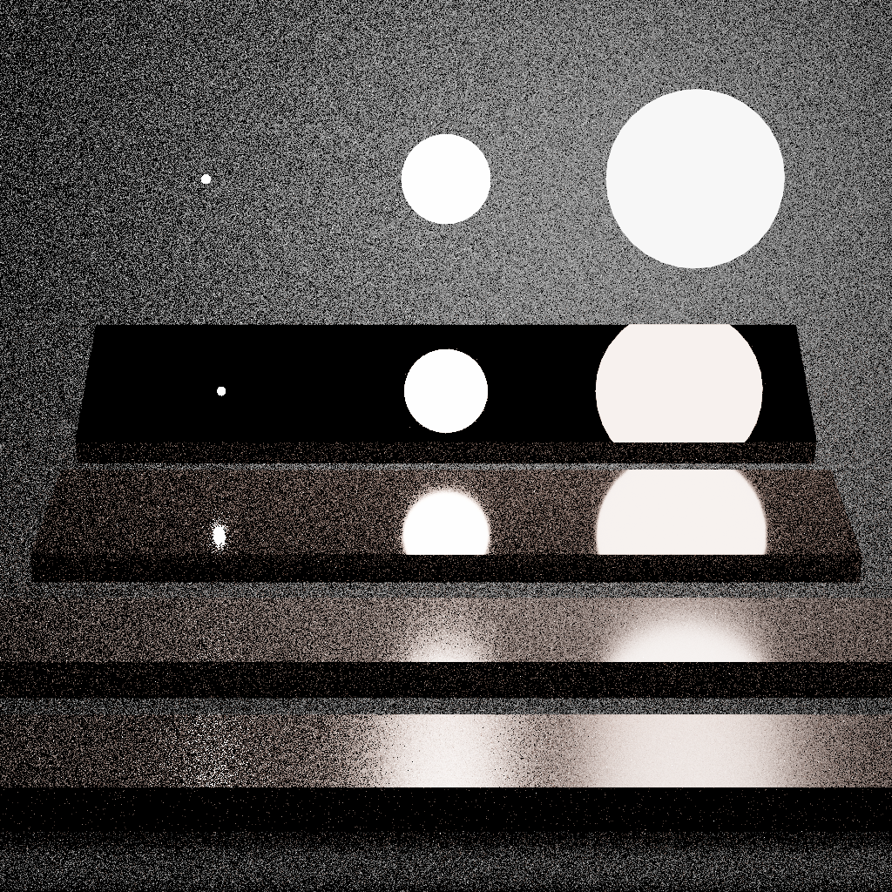 | 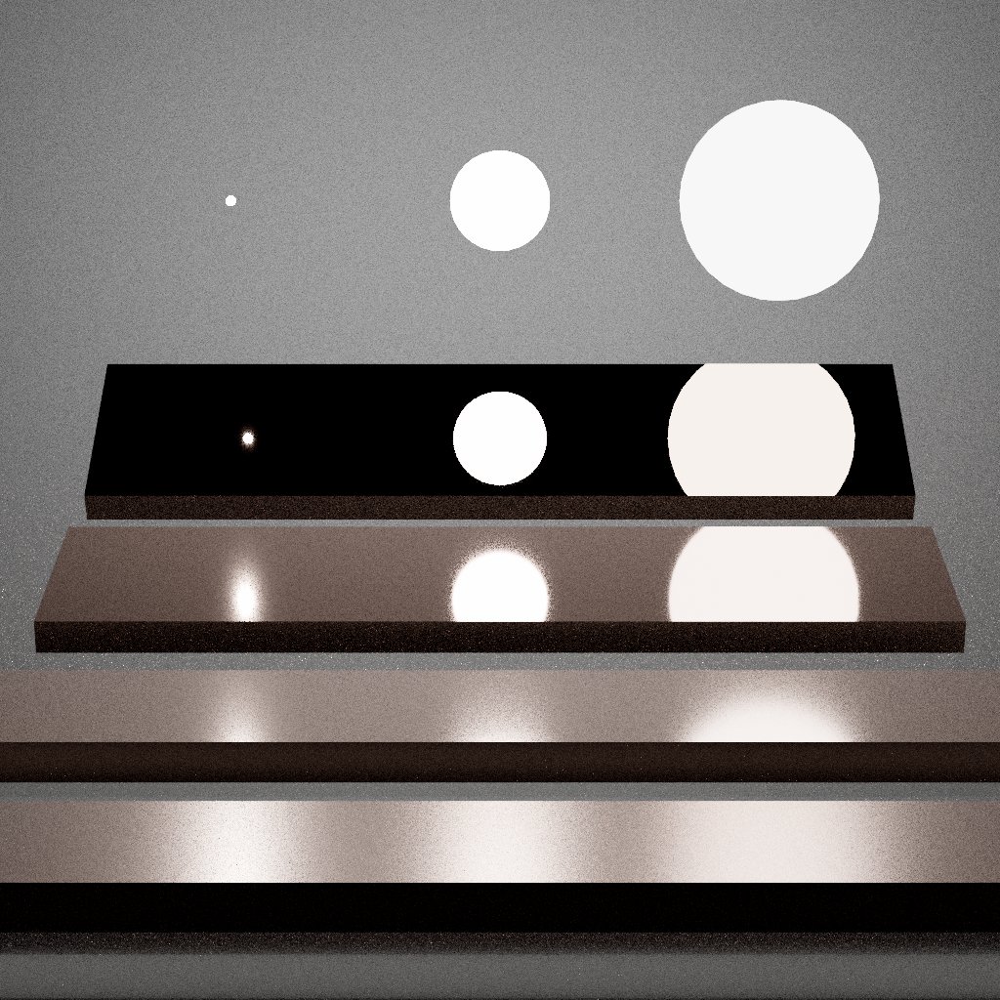 |

- **Veach MIS**: four lights of very different sizes over plates of increasing roughness, the case MIS was made for. The RMSE of the displayed image against a 4096 spp render drops from 62.8 to 9.1 (of 255), 48x less variance, at 2.34 against 1.46 ms/spp.

#### Checking it

Both strategies estimate the same light, so with enough samples NEE + MIS and BSDF sampling alone have to converge to the same image. `--out name.hdr` saves the scene-linear average without the view transform, which these numbers come from. PNGs are not a fair test here: BSDF sampling's fireflies clip at 255, which made NEE look 2% brighter on Veach MIS.

| scene, 320x320, 4096 spp | mean, NEE + MIS / BSDF only |
|---|---|
| cornell | 1.0003 |
| cornell_glass | 1.0006 |
| transmission_roughness | 1.0004 |
| clearcoat | 0.9999 |
| dragon_attenuation | 1.0003 |
| sponza | 0.9994 |
| cornell_helmet | 1.0004 |
| veach-mis (640x360, 16384 spp) | 0.9997 |

Per 16x16 block the median difference is at most 0.11%, on Sponza.

#### Emissive textures in the light power

A triangle's power used to be 2π x area x the luminance of its material's emission factor alone. DamagedHelmet's emission factor is 1 over the whole helmet, while its emissive texture is black except for the lamp details (its texels average a luminance of 0.002). In `cornell_helmet` the helmet therefore counted as brighter than the ceiling light (981 against 569) and drew 63% of the light picks. Nearly every one of those samples landed on a black texel and returned nothing, and the ceiling light, which lights the room, got the remaining 37%. ClearCoatTest's labels, white text on a black emissive texture, had the same problem.

Each material's emission is now weighed as its emission factor times the average color of its emissive texture over the whole image, the way PBRT-v4 weighs an image area light, and the helmet's share drops to 0.3%. A point is still picked uniformly by area within its triangle, whatever the texture holds there, so the density stays one number per material. `cornell_helmet` is the only scene here where this shows: in Bistro and ClearCoatTest the textured emitters never took a large share of the picks.

`cornell_helmet`, 1024x1024, 64 spp, AgX. Bottom row: the floor in front of the helmet at 2x.

| Before: emission factor only | After: factor x texture average |
|:---:|:---:|
| 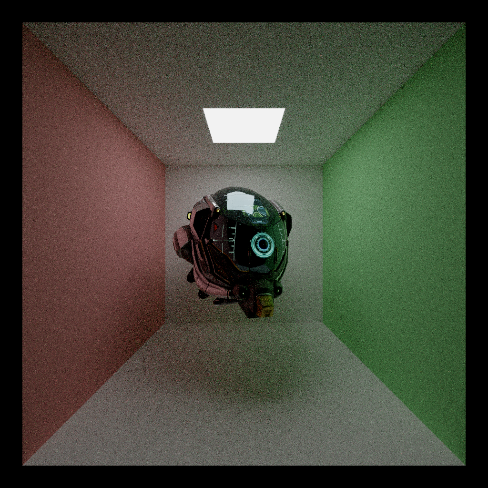 | 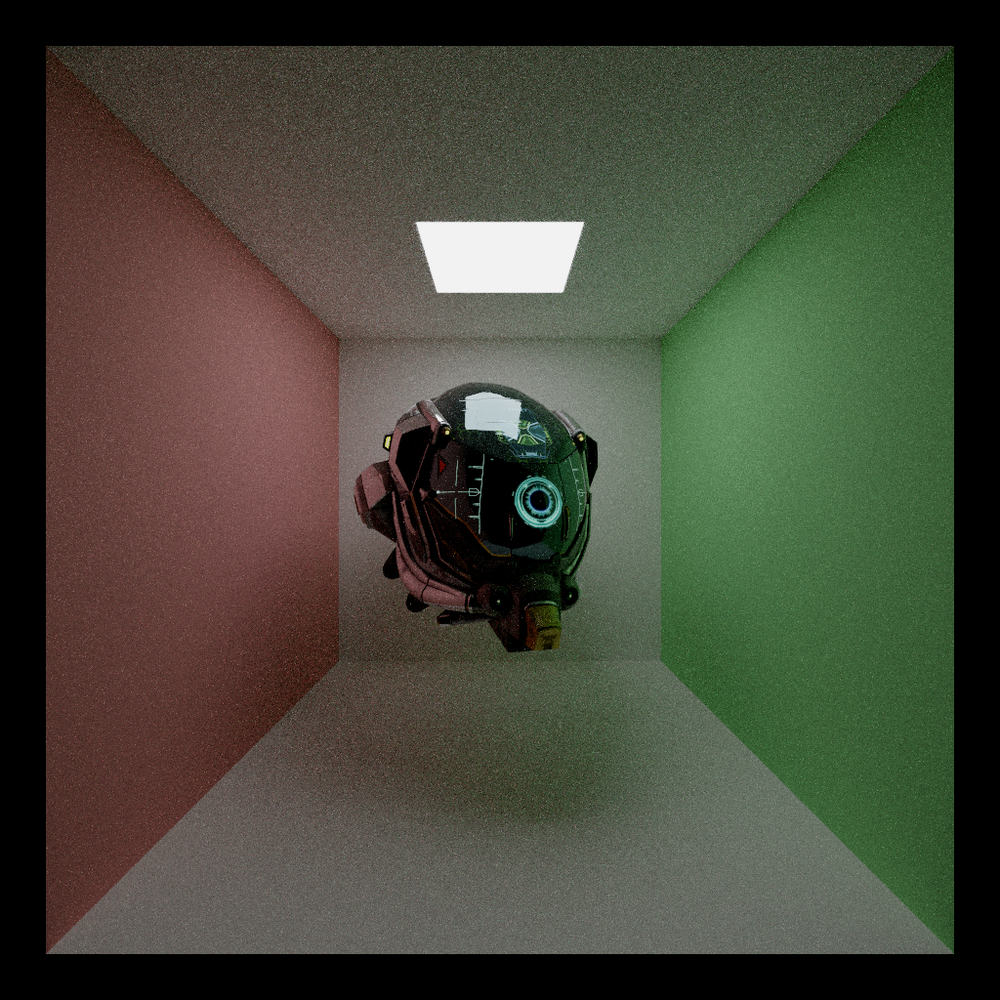 |
| 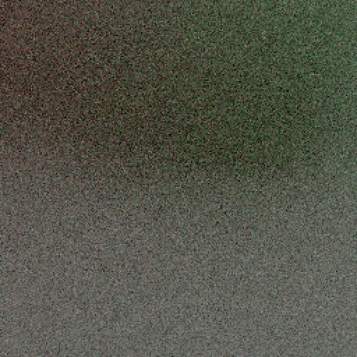 | 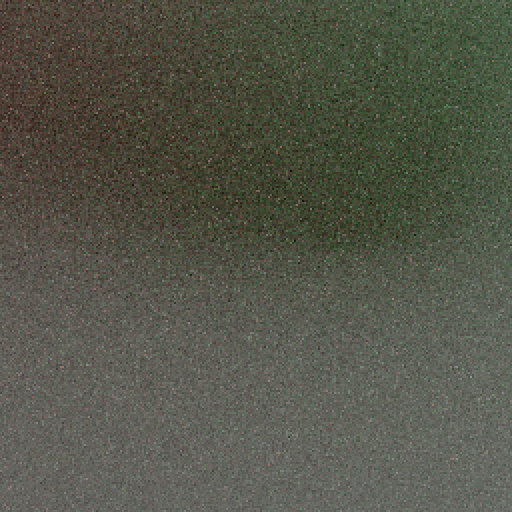 |

- **Noise**: the RMSE of the displayed image against a 4096 spp render drops from 12.9 to 9.2 (of 255), 49% less variance, about what twice the samples would give. Most of the noise left in the room is indirect light, which the light picks do not touch.
- **Mean**: unchanged, and at 4096 spp the render still matches BSDF sampling alone within 0.04%.
- **Frame time**: 3.0 against 2.9 ms/spp.

### Environment map sampling

With the environment found by BSDF sampling alone, a diffuse surface under a sunset HDRI sends its rays all over the sky and hits the sun by luck: a few pixels per frame get the sun's full radiance and the rest get none, which is the grain in the left column below. The environment is now one of the lights next event estimation picks, with a sampling table built from the map, and a path that leaves the scene weighs the environment's light against that strategy with the same power heuristic as a hit on an emitter.

#### The table

At load, `src/scene/environment.cpp` gives every texel of the lat-long map a weight, its luminance times sin θ, since a row near a pole covers less of the sphere than its share of the image. The weights become a 2D distribution drawn in two 1D steps: a marginal CDF over the rows picks a row, and that row's conditional CDF picks a column. Both searches are the binary search the light pick uses, so a draw from a 4096x2048 map costs 11 plus 12 steps. The sample is placed inside the cell by where the two random numbers fell within their steps, not at the cell's center, and the cell's density over the unit square turns into a density over directions through the mapping's Jacobian:

```
p_env(ω) = pdf_uv / (2π² sin θ)
```

A miss computes the same value for the direction it left in, from the cell that direction falls into, so the two sides of the MIS weight see one function. The rotation a scene gives its map is applied to the sampled direction on the way out, with the transpose of the lookup's matrix; the density is the same in both frames. A one-color environment has no table and is sampled uniformly over the sphere, pdf 1 / 4π. The table takes two floats per texel on the device, 64 MB for a 4k map.

The table steers the picks; the radiance a sample brings back is read from the texture at the sampled direction, and that read is filtered bilinearly, so inside a cell it slides from the texel's own value toward the neighbors' at the edges. A black texel next to a bright one returns light over half its cell. Each cell's entry is therefore the average of what the texture returns over the cell, which works out to the [1 6 1]/8 filter of the texels along each axis, wrapping in u and clamping in v as the texture does, so the picks follow the values the texture reads out rather than the one stored at each center. With MIS this changes the noise, not the mean: a direction the table never draws is still covered by the BSDF sample at weight 1, the same way compensation gets away with zeroing the sky.

The environment's share of the light picks follows its power like every other light's: π r² times its luminance integrated over all directions, the flux through a disk as large as the scene, which is what the distant light already uses with its irradiance. The light list is rebuilt when the window swaps the map, since the shares of the other lights change with it.

#### MIS compensation

Where the sky is dim and even, BSDF sampling already finds it well, and the environment samples the table sends there are wasted. The table is built with the map's average radiance subtracted from every texel and the rest clamped at zero (Karlík et al. 2019, as PBRT-v4 does), so the picks go to the sun and the bright patches and the even part of the sky is left to the BSDF side, which gets weight 1 there since the environment's density is zero. A map that is one color all over compensates to nothing and keeps its plain weights. `--no-env-compensation` builds the plain table instead, and `--no-env-nee` leaves the environment out of the light list altogether.

#### Comparisons

`hdri_helmet` under `venice_sunset_4k.hdr`, 1024x576, 64 spp, AgX. Bottom row: the floor in front of the diffuse sphere at 2x.

| Environment by BSDF sampling | Environment NEE + MIS | With MIS compensation |
|:---:|:---:|:---:|
|  | 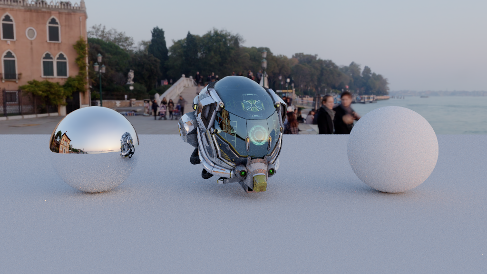 | 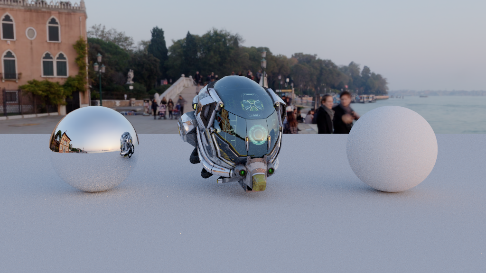 |
| 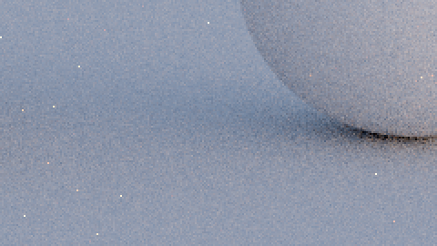 | 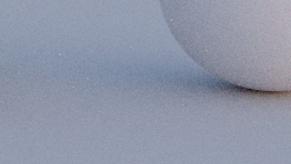 | 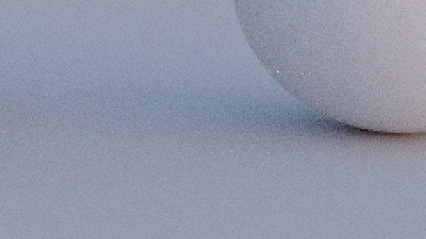 |

- **Noise**: the RMSE of the displayed image against a 4096 spp render goes from 4.34 to 2.85 to 2.69 (of 255): 0.43x the variance with the environment in the light list, 0.38x with compensation.
- **Frame time**: 1.11, 1.55 and 1.37 ms/spp. The shadow rays toward the environment run to the end of the scene, and the two binary searches read a 64 MB table at random.
- The specks left on the floor are the sun reflected by the chrome sphere, a caustic no light sample reaches.

living-room, lit by its sky map alone, 1024x576, 256 spp, AgX. Bottom row: the ceiling and wall above the right windows at 2x.

| Environment by BSDF sampling | Environment NEE + MIS | With MIS compensation |
|:---:|:---:|:---:|
|  | 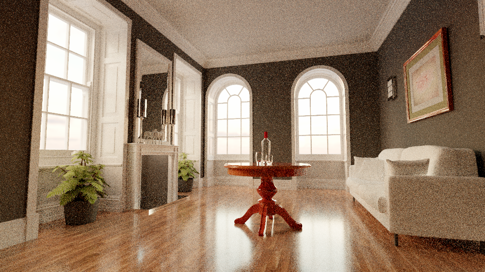 |  |
| 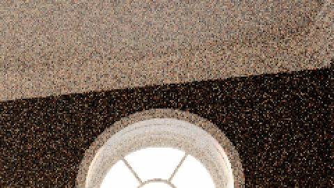 |  | 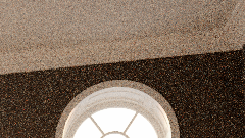 |

- **Noise**: RMSE against a 2048 spp render 24.5, 16.1 and 14.9: 0.43x and 0.37x the variance. The light samples clear the walls and the floor near the windows; what is left is indirect light and the window frames, which the samples hit from inside.
- **Frame time**: 4.34, 7.42 and 6.85 ms/spp. Most environment shadow rays from inside a room end on a wall, and the table draws them anyway.

#### Correctness

The two strategies have to agree with BSDF sampling alone in the mean. A furnace, a white diffuse object under a constant environment of 1, is the sharpest check: every pixel's answer is exactly 1. `--out name.exr` keeps the scene-linear average as float32, which these numbers come from; see the last issue below for why `.hdr` is not good enough here.

| scene, 320x320, 1024 spp | mean, environment NEE + MIS / BSDF only |
|---|---|
| furnace, sphere, one-color environment (uniform sphere sampling) | 1.00001 |
| furnace, cube | 1.00000 |
| furnace, floor seen from above | 1.00003 |
| furnace, sphere, the constant map as a 64x32 image (the table) | 0.99999 |

A 512x256 map with a sky of 0.1 and a 4x4 texel sun of 10⁴ at 45° over the floor: 3.9221 with compensation and 3.9221 without, against 3.913 ± 0.004 from BSDF sampling at 65536 spp (the sun is 0.05% of its hemisphere) and 3.924 by hand from the texels. Compensation cuts the per-pixel variance by 25% there; the sky is dim, so the plain table already sends nearly every pick to the sun.

| scene, 320x180 | spp | mean, environment NEE + MIS / reference |
|---|---|---|
| hdri_helmet, against `--no-nee` | 4096 | 0.9999 |
| living-room, against `--no-nee` | 2048 | 0.9998 |
| classroom, against `--no-env-nee` (the sun is a distant light, which `--no-nee` cannot find) | 8192 | 0.9993 |
| breakfast-room, against `--no-env-nee` | 8192 | 1.0012 |

The 52 renders of `tests/cmp_renders.sh`, none of which has an environment, stay byte-identical.

### View transform

The accumulation buffer is scene-linear and never touched. Tonemapping is applied once at display and once at save, through the same function in `src/render/tonemap.h`, so the viewport and the PNG agree. Default is AgX punchy.

- **AgX** by Troy Sobotka, published as an OpenColorIO config: https://github.com/sobotka/AgX. The analytic version this project uses (inset/outset matrices, log2 shaper, polynomial sigmoid) is Benjamin Wrensch's "Minimal AgX Implementation": https://iolite-engine.com/blog_posts/minimal_agx_implementation. `agx-punchy` adds the "punchy" look from the same post, an ASC CDL grade (power 1.35, saturation 1.4) between the sigmoid and the outset matrix, matching the look of that name in Blender.
- **ACES**, two fits of the reference RRT+ODT, picked by the `ACES_FIT_HILL` macro in `tonemap.h`. Default is Krzysztof Narkowicz's single rational curve: https://knarkowicz.wordpress.com/2016/01/06/aces-filmic-tone-mapping-curve/. The alternative is Stephen Hill's fit with the sRGB to AP1 round trip, from `ACES.hlsl` in MJP's BakingLab: https://github.com/TheRealMJP/BakingLab/blob/master/BakingLab/ACES.hlsl. Hill's is scaled by 1/0.6 on input, same as three.js, so the two match in brightness. On Cornell they are within a few levels of each other once that's done.

Same accumulation buffer through each transform. Glass Cornell, 600x600, 1000 spp, exposure 1.0, DEPTH 8:

<!-- TODO: replace these four with the final hero shot through the same four transforms. Cornell has no saturated highlights, so the hue-skew difference between ACES and AgX barely shows here. -->

| ACES, Narkowicz fit | ACES, Hill fit (1/0.6) |
|:---:|:---:|
|  |  |
| **AgX** | **AgX punchy** |
|  |  |

### Performance optimization

The renderer was profiled in two passes on 2026-10-02: the first with per-stage timing, the second with Nsight Systems and Nsight Compute. The first pass changed two defaults: the material sort is off (its gather cost 2 to 3.5x the frame on every scene and saved the shade kernel at most 0.3 ms), and the per-stage error-check waits are off in Release (5 to 10% at 1024x1024). The first entry below is the earlier optimization both build on; the second came out of the Nsight pass.

#### Compaction and sort: thrust to CUB with device LTO

Measured 2026-09-25, before the glTF materials.

**The first version used thrust.** Compaction was `thrust::stable_partition`, the sort was `thrust::sort_by_key` over the path and intersection arrays together, and a `finalGather` kernel added every path's color to the image after the bounce loop. It produced the right image and spent most of the frame outside the kernels; the "Issues along the way" entry below has the numbers.

**The current version uses CUB with a workspace allocated once.** All scratch memory (spare path and intersection buffers, the sort's index arrays, CUB's temporary storage) is allocated in `wavefrontInit` at the largest path count the loop can see, so nothing is allocated during a sample.

* Compaction is a CUB select of the live paths into the spare buffer, then a pointer swap. Terminated paths are dropped rather than moved to the back, which is why light goes into the image inside `shadeMaterial` (today at the hit that emits it, see [Emission](#emission)) and `finalGather` is gone. (Since replaced: compaction now happens inside `shadeMaterial`, see [Compaction moved into the shade kernel](#compaction-moved-into-the-shade-kernel).)
* The sort no longer moves the path strubcts through every radix pass. It sorts (material key, path index) pairs over only the bits the material count needs (one pass for Cornell instead of four), then gathers paths and intersections into the spare buffers once.

Both operations are out of place and ping-pong: the caller's `dev_paths` and `dev_intersections` point at a different allocation after every call, and the old one becomes the spare.

| Before and after, one sample | Buffer ownership through one bounce |
|:---:|:---:|
|  |  |

The buffer diagram shows this version. Compaction now happens inside shading (next entry): `shadeMaterial` reads the current buffer and writes only the live paths into the spare, so the separate compact step and its CUB select are gone.

**Results.** Cornell, headless, `--tonemap none`, median of 5 interleaved runs per cell, GPU otherwise idle. Every build produces a byte-identical PNG at the same settings (checked with `cmp`), so the rows differ in time only.

| build | 400x400, 100 spp | 800x800, 50 spp | 1024x1024, 50 spp |
|---|---|---|---|
| thrust | 4.96 | 14.86 | 22.90 |
| thrust + LTO | 3.69 | 9.54 | 14.08 |
| CUB + LTO (current) | 0.64 | 1.38 | 2.07 |

Each cell is ms per sample.


At 1024x1024 the frame went from 22.90 to 2.07 ms per sample, 11x. Device LTO is 1.6x of that on its own. The rest is the CUB rewrite: no allocation per call, no copy back, dead paths dropped instead of partitioned to the back.

#### Compaction moved into the shade kernel

Measured 2026-10-03, material sort off.

**What the profile showed.** In an Nsight Systems capture of Cornell at 1024x1024, the CUB compaction (`DeviceCompactInitKernel` and `DeviceSelectSweepKernel`, once per bounce) took 0.49 ms of a 2.59 ms sample, 19%; on Intel Sponza it was 6%. The select reads every path that `shadeMaterial` has just written and writes the live ones a second time into the spare buffer, and its blocks spend much of that time at a barrier while one warp works out the tile's offset from the tiles before it (44% of the sweep's stall samples sit on that one shared-memory read). The two launches also add two launch gaps per bounce.

**How it works now.** `shadeMaterial` writes the paths that go on straight into the spare buffer, so nothing reads the paths a second time:

1. After shading, each thread knows whether its path is still alive. The warp votes on it with `__ballot_sync`, which gives every lane a 32-bit mask of the surviving lanes.
2. Lane 0 reserves room for the warp's survivors with one `atomicAdd` on a device counter and passes the base index to the other lanes with `__shfl_sync`.
3. Each survivor writes its struct to the base plus the number of survivors in the lanes below it (`__popc` of the mask with the higher lanes cleared). A warp's survivors land next to each other, so the stores stay coalesced.
4. A path that ended is not written anywhere. Its light is already in the image.

Every lane has to reach the vote, so the kernel's early returns became an `alive` flag. The counters are a ring of three on the device: each bounce appends into its own counter and one thread zeroes the counter the next bounce will use, so no counter is reset while anything still reads it. The host still copies the count back after each bounce to size the next launches, and the path buffers still ping-pong.

**The image is unchanged.** The order of the survivors in the buffer now depends on the order in which the warps' atomics land, which varies from run to run. Nothing reads that order: every pixel has exactly one path per sample, and the shading random numbers and the alpha test are seeded with the pixel index, the sample and the bounce, never with a path's position in the array. All 52 renders of the cmp set (13 scenes, both intersection paths, 400x400 and 401x399) are byte-identical to the build before the change.

**Results.** Headless, 1024x1024, 100 spp, median of 5 alternated runs per side, GPU otherwise idle.

| scene | CUB compaction | compaction in shade | saving |
|---|---|---|---|
| Cornell | 2.34 | 1.66 | 0.68 (29%) |
| Intel Sponza | 6.10 | 5.63 | 0.47 (7.7%) |

Each cell is ms per sample.

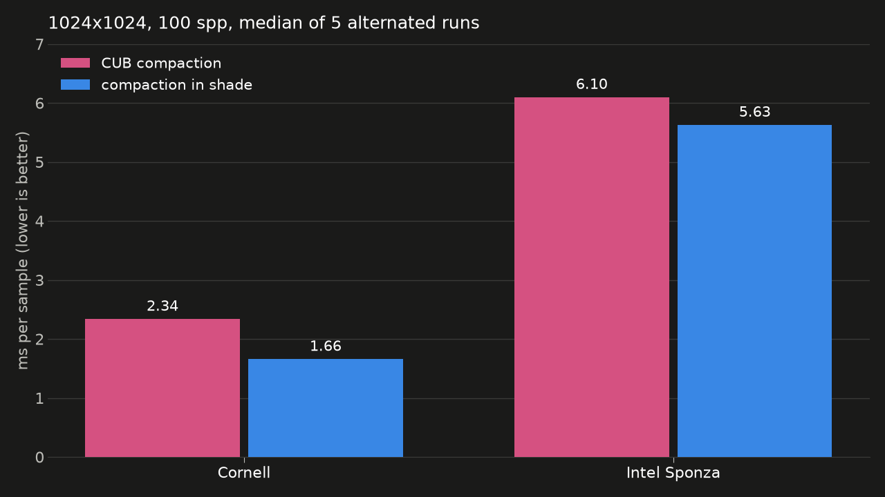

- **Compaction kernels**: gone, 0.49 ms.
- **`shadeMaterial`**: 0.67 to 0.54 ms. It now writes only the survivors, and at bounces 1 to 3 on Cornell 18, 30 and 50% of the paths it used to write had already ended. By bytes alone that is about 0.05 ms; I have not looked into where the rest comes from.
- **Idle time**: 0.10 ms less, from the two launch gaps per bounce that went with the compaction kernels and slightly shorter waits before each OptiX launch.

**Keeping the alive count on the GPU (tested, left out).** After this change the trace still showed a 51 to 61 µs wait before every OptiX launch: the host copies the survivor count back and waits for it before it can size the next bounce. I tested keeping the count on the device instead, with every bounce launched at the pixel count and each kernel leaving the lanes past the live count idle. The waits in the trace dropped to 7 µs, but the A/B gained only about 0.07 ms per sample on Cornell and 0.1 to 0.2 ms on Intel Sponza. My guess is that much of the wait in the trace was the profiler's own overhead on the copy and sync, since the build with the readback ran at 1.87 ms per sample under Nsight Systems and 1.66 without it. For that gain the host would queue whole samples ahead of the GPU, a kernel error would only show at the end of a render, and the material sort would need its own path, so I left it out.

### Issues along the way

Things that went wrong and what they turned out to be. Kept as a running log.

#### The OptiX cube kept the outward normal on exit hits

`boxIntersectionTest` returns the normal facing the ray on both entry and exit (on the exit face it stores the slab's entering normal, which points back inside). The OptiX cube hit program returned the face's outward normal in both cases. Nothing in Cornell starts a ray inside a wall, and the glass tests used the sphere, so the two paths agreed on every scene until the Box model test: a glass cube as a mesh rendered right on both paths, while the same cube as a scene cube came out dark under OptiX (mean 72 vs 78 of 255). The mesh hit program had been written with the flip, the cube one had not. One sign flip on the inside branch, and the cube scene matches the naive path to the same 4 levels as the mesh scenes.

600x600, 1000 spp, DEPTH 8, AgX, OptiX:

| Outward normal on exit | Normal facing the ray |
|:---:|:---:|
|  |  |

#### Schlick used the wrong cosine on exit

Schlick's approximation needs the cosine on the air side of the interface. Entering glass that is the incident angle. Leaving glass it is the transmitted angle, which the original code did not use. Real Fresnel reflectance hits 100% at the critical angle (about 42° for IOR 1.5), but with the incident cosine the curve did not get there until 90°, so exit rays just below critical leaked out instead of reflecting back inside. The fix computes `k = 1 - eta²(1 - cos²θ)` directly, uses `sqrt(k)` as the Schlick cosine when `eta > 1`, and treats `k < 0` as total internal reflection.

1000x1000, 500 spp, DEPTH 8, cropped to the sphere:

| Before | After |
|:---:|:---:|
|  |  |

Pixel difference, amplified 8x. The change is confined to the rim and the caustic under the sphere:


Notice that the fixed image is slightly *darker* at the rim. This is due to the fixed version keeps that light inside for more bounces, and with DEPTH 8 some of those longer paths hit the cap and get thrown away, in general this makes rays less likely to hit a light at the same depth. By changing the depth cap:

| Region | DEPTH 8 | DEPTH 32 |
|---|---|---|
| Sphere interior | 52.4 | 59.6 |
| Sphere rim | 40.4 | 44.7 |
| Floor caustic | 170.6 | 173.0 |
| Whole image | 25.3 | 27.8 |

We can see the depth cap was eating about 14% of the sphere's brightness on its own. The Schlick fix moved under 1%. This means glass materials needs a a lot higher depth than diffuse scenes. Honestly a surprise rabbit hole digging that landed this conclusion.

#### The sort and compaction were spending the frame in cudaMalloc

With the thrust version in, a 400x400 sample took 13 ms with the sort on and 5 ms with it off, and I assumed that was the sort itself. Timing each stage with CUDA events (Cornell 400x400, one sample, sort on, on the device LTO build so the kernels are at their real cost) said otherwise:

| stage | generate | intersect | sort | shade | compact | gather |
|---|---|---|---|---|---|---|
| ms | 0.08 | 0.36 | 8.9 | 0.21 | 4.0 | 0.03 |

The kernels add up to under 0.7 ms. The other 13 ms were in two thrust calls, for two reasons.

- Every thrust algorithm under the `thrust::device` policy allocates its scratch memory with `cudaMalloc` and frees it with `cudaFree` on the way out. `cudaFree` waits for all outstanding GPU work and `cudaMalloc` takes a device-wide lock. `stable_partition` is a composite (copy to a temporary, select the live paths to the front, write the dead ones to the back through a reverse iterator), each step with its own scratch, times eight bounces.
- `sort_by_key` over the zip iterator materializes the values into a temporary array of 68-byte tuples, radix-sorts 32-bit keys in four passes with every pass reading and writing every key and value, then copies back through the zip. Around 700 bytes of traffic per path per bounce, for a path that occupies 44 bytes.

Handing the same thrust calls a caching allocator (`thrust::cuda::par(alloc)`) removed 60 to 70% of both stages on its own, so that share was allocation. The rest was the copy-back and the extra passes, which is what the CUB version with a preallocated workspace and an index sort removes. Details and numbers in the performance section above.

#### Separable compilation left the intersection tests as real function calls

The base code's `CMakeLists.txt` sets `CUDA_SEPARABLE_COMPILATION ON`, which it needs so that `intersections.cu` and `interactions.cu` can be their own files. Without device link-time optimization, a `__device__` function defined in another file cannot be inlined into the kernel that calls it. `cuobjdump --dump-sass` on the exe showed `boxIntersectionTest`, `sphereIntersectionTest` and `scatterRay` as separate functions with `CALL.ABS` sites inside the kernels, and the call ABI shows up as local memory traffic:

| kernel | device calls | local memory instructions (STL/LDL) |
|---|---|---|
| `computeIntersections`, before | 3 | 72 |
| `shadeMaterial`, before | 4 | 38 |
| `computeIntersections`, with `-dlto` | 0 | 0 |
| `shadeMaterial`, with `-dlto` | 0 | 10 |

`Geom` is passed by value (three mat4), the output references need addresses, and the register copy of the path in `shadeMaterial` has to live in local memory because `scatterRay(PathSegment&)` takes its address across a call. So the "copy to registers, write back once" pattern in `shadeMaterial` was not happening at all.


The fix is two lines in `CMakeLists.txt`: `-dlto` on the CUDA compile options and `$<DEVICE_LINK:-dlto>` on the device link options, Release only. Byte-identical image, and the no-sort frame got 25 to 40% faster depending on resolution, before any of the compaction work. The cost is at build time: the device link step takes about 4 s on every incremental build, since the inlining happens there.

#### The orbit camera mirrored any EYE off the z axis

The base code turns EYE into orbit angles with `acos`, which returns `[0, pi]` and drops the sign of x and of the pitch. So an eye at x = -4 was placed at x = +4 and an eye at height 8 ended up near the floor looking up. The rebuilt `right` and `up` were also not normalized (length cos(pitch)), which zoomed any pitched view in by 1/cos(pitch). The fix computes the angles from the eye's offset with `atan2`, normalizes the basis, and orders the loader so `view` exists before `right` is derived from it. Cornell's shipped camera sits on the z axis at lookAt height, the one spot where the old math was right, so its renders did not change.

400x400, 200 spp, AgX:

| EYE (-4, 5, 10.5) before | after | EYE (3, 8, 9) before | after |
|:---:|:---:|:---:|:---:|
|  |  |  |  |

In the same pass, `FOVY` was being read as a half angle (`tan(fovy)` where `tan(fovy/2)` belongs), so 45 in the scene file was a 90 degree vertical field. The loader now takes the full angle and the scene files say 90, which renders the same image and stops the value from capping when matching a real lens or a glTF camera.

#### Intel Sponza's dirt decals rendered as solid walls

Intel Sponza's courtyard walls carry `dirt_decal`, the file's one `alphaMode: BLEND` material, on three decal meshes (one per floor) laid over the walls. Its texture is dark grime (mean 75 of 255) with alpha under 0.5 on 70% of its texels, and the material multiplies alpha by 0.35 on top, so the decals should cover about 12% of the wall on average. The loader treated BLEND as opaque, so the full dark texture covered the walls and the stone only showed in the gaps between decals, which looked like dark brown plaster with patches broken off.

The fix is just actually support alpha blending: a hit counts with probability alpha, and otherwise the ray goes on, in the same any-hit program and naive-kernel test that handle [alpha mask](#alpha-mask). The random number is a hash of the pixel, iteration, depth, instance and triangle, so both intersection paths make the same decision for the same hit, and OptiX gets the same answer when it calls any-hit more than once for a triangle.

1280x720, 256 spp, DEPTH 8, AgX, OptiX:

| BLEND as opaque | BLEND as coverage |
|:---:|:---:|
|  |  |

#### Smaller base code fixes

- **Every camera move freed and reallocated all device buffers.** A drag re-ran the full init per mouse event, about 2.8 ms at 800x800, more than a frame now costs. Buffers are allocated once; a camera change clears the image and resets the sample count.
- **The accumulation buffer was copied to the host every iteration** so the S key could save at any time. The copy now happens inside save.
- **A CUDA error waited on `getchar()` before exiting** on Windows, which hangs a headless run. Removed; the message goes to stderr either way.

#### A 0.27% bias that was the image format

The first furnace renders with environment NEE came out 0.27% dark in the mean against BSDF sampling, on the sphere, on a cube and on a flat floor alike, and the shadow rays, the MIS weights and the random number stream all checked out. The renders were compared as `.hdr`, Radiance RGBE: an 8-bit mantissa per channel, truncated, not rounded. The BSDF-only image is exactly 1.0 everywhere, which RGBE stores exactly. The NEE image is 1.0 plus a little noise, and every pixel slightly under 1.0 truncates down to 255/256 while every pixel slightly over stays at 1.0, so the whole image took 15 distinct values and its mean landed 0.27% low. Two noisy images truncate alike and their ratio hides this, which is why the NEE table above was fine in `.hdr`. `--out name.exr` now writes the float32 average as it is, through tinyexr, and the furnace means came back to 1.0000.

### Viewport controls

The viewport navigates like the Unreal Engine 5 level editor: hold the right mouse button to look around and fly, or hold Alt for the Maya-style orbit. Any camera move restarts the accumulation.

| Input | Action |
|---|---|
| RMB drag | Look around in place |
| RMB + W / S | Fly forward / back |
| RMB + A / D | Fly left / right |
| RMB + E / Q | Fly up / down along world +Y |
| RMB + wheel | Fly speed up / down, x1.25 per notch (shown in the ImGui panel) |
| LMB drag | Up / down moves along the ground, left / right turns |
| MMB drag, or LMB + RMB drag | Pan |
| Wheel | Move forward / back in steps |
| Alt + LMB drag | Orbit around the pivot |
| Alt + RMB drag | Move toward / away from the pivot |
| Alt + MMB drag | Pan |
| F | Back to the scene file's camera |
| Ctrl + S | Save the image |
| Esc | Save the image and quit |

The ImGui panel also switches scenes without a restart. Its combo lists the scene JSONs in `scenes/` and the catalog's names (entries whose glTF is not downloaded are grayed out), and the field under it takes anything the command line takes: a name or a path to a .json, .gltf or .glb. The new scene is read first, so a bad file leaves the current scene in place with the error in the panel. On success the device buffers are rebuilt, the window takes the new scene's resolution, the camera starts at its scene camera and the accumulation starts over; `--res`, `--spp` and `--depth` from the command line still apply. The window is busy while a large scene loads (Intel Sponza takes a few seconds).

The camera is a position, a yaw about world +Y, a pitch that stops just short of straight up or down, and a pivot distance. The orbit pivot sits on the view axis at that distance and travels with the camera. It starts at the scene's `LOOKAT`, or for a glTF camera at a point on its view axis near the middle of the scene. The default fly speed crosses the scene's bounding box diagonal in 4 seconds. A drag hides and locks the cursor, so it does not stop at the edge of the screen. Headless renders build their basis from the same pose as the window's first frame.

### Headless rendering
Render without a viewport
```
./build/bin/Release/cis565_path_tracer.exe scenes/cornell.json --headless --spp 100 --res 400x400 --out img/test/cornell.png
```

The scene argument is a path, or a name: `cornell` is `scenes/cornell.json`, and `veach-mis` is the research scene of that name. Names other than the scene JSONs come from `scenes/catalog.json`, which maps a short name to each glTF scene under `scenes/assets` (the 26 research scenes in their extended variant, and the two Bistro files), so the files stay where their downloads put them. `--list` prints every name and marks the ones not downloaded.

| Flag | Effect |
|---|---|
| `--headless` | No GLFW / ImGui / OpenGL. Render, save, exit. Prints total time and ms per sample. |
| `--list` | Print the scene names and exit |
| `--spp N` | Override `ITERATIONS` from the scene file |
| `--res WxH` | Override `RES` from the scene file |
| `--depth N` | Override `DEPTH` from the scene file, the most rays a path may trace |
| `--out path.png` | Write exactly this file. Default is the usual `img/auto_saved/<FILE>.<time>.<spp>samp.png`. An `.exr` path keeps the scene-linear average as float32, without view transform or exposure, for comparing renders by their numbers; `.hdr` does the same with 8-bit mantissas |
| `--env FILE` | Light the scene with this lat-long `.hdr` or `.exr` instead of its own environment |
| `--no-nee` | No next event estimation: lights count only when a path hits them |
| `--no-env-nee` | Leave the environment out of the light list, so paths find it by BSDF sampling only |
| `--no-env-compensation` | Build the environment's sampling table from its radiance alone, without MIS compensation |
| `--no-rr` | Disable Russian roulette |
| `--sort` | Sort paths by material before shading. Off by default since the 2026-10-02 profile, where its gather cost 2 to 3.5x the frame on every scene; `--no-sort` is the default, kept for scripts |
| `--no-optix` | Intersect with the naive per-object kernel instead of the OptiX stage |
| `--optix-validate` | OptiX validation mode: checks every launch, slow |
| `--timing` | With `--headless`: print load, init and per-bounce stage times as CSV lines |
| `--tonemap none\|aces\|agx\|agx-punchy` | View transform for viewport and PNG. Default `agx-punchy`. `none` is the raw clamp the base code shipped with |
| `--exposure X` | Linear multiplier before the view transform. Default 1.0 |

The overrides also work in windowed mode. Output is deterministic, with same scene, spp, resolution and tonemap produce a byte-identical PNG, so `cmp` against a previous render can be used to prove correctness for things that only improves performance but shouldn't alter the image at the same sample count.

`tests/cmp_renders.sh` runs that check over 13 scenes (the JSON scenes, the textured and masked glTF ones, the three Khronos material tests and a research scene), both intersection paths, at 400x400 and 401x399. `golden` renders the set into `build/golden` before a change, `compare` renders it again after and cmps every PNG against its golden, and the exit code is nonzero when any of them differs.

### Test assets

`scenes/assets/` is gitignored, so the models below are downloaded into it. They come from three places:

- **[KhronosGroup/glTF-Sample-Assets](https://github.com/KhronosGroup/glTF-Sample-Assets)**: Box, Duck, Suzanne, DamagedHelmet, Sponza and the three material tests. A model's folder `Models/<name>/glTF/` goes under `scenes/assets/<name>/glTF/`, with its `.gltf`, `.bin` and image files. The material tests are the `.glb` files from `Models/<name>/glTF-Binary/`, under `scenes/assets/KhronosTests/`; they are made for environment lighting and have no light of their own, so their scene files add an emitting panel.
- **[Intel Sample Library](https://www.intel.com/content/www/us/en/developer/topic-technology/graphics-processing-research/samples.html)**: Intel Sponza and its curtains package.
- **[NVIDIA Open Research Content Archive](http://developer.nvidia.com/orca/amazon-lumberyard-bistro)**: Bistro exterior and interior, converted from FBX.

| model | triangles | scene file | credit |
|---|---|---|---|
| Box | 12 | `cornell_boxmesh.json` | Cesium, 2017, CC BY 4.0 |
| Duck | 4,212 | `cornell_duck.json` | Sony, 2006, SCEA Shared Source License 1.0 |
| Suzanne | 3,936 | `cornell_suzanne.json` | Norbert Nopper / UX3D, 2017, CC0 |
| DamagedHelmet | 15,452 | `cornell_helmet.json` | theblueturtle_, 2016, CC BY-NC 4.0; glTF rebuild by ctxwing, 2018, CC BY 4.0 |
| Sponza | 262,267 | `sponza.json` | Crytek (Frank Meinl), CryENGINE Limited License Agreement, glTF conversion from the Khronos repo |
| TransmissionRoughnessTest | 77,792 | `transmission_roughness.json` | Ed Mackey, Analytical Graphics, 2021, CC BY 4.0 |
| DragonAttenuation | 134,995 | `dragon_attenuation.json` | Dragon: Stanford Computer Graphics Laboratory, 1996, converted by Morgan McGuire, 2017, Stanford Graphics Library license; cloth backdrop: Adobe, CC0 |
| ClearCoatTest | 37,116 | `clearcoat.json` | Ed Mackey, Analytical Graphics, 2020, CC BY 4.0 |
| Intel Sponza, main and curtains | 3,747,018 + 1,997,366 | `sponza_intel.json` | Frank Meinl and Anton Kaplanyan, Intel, 2022, CC BY 4.0; curtains add-on by the Sponza Addon Package Crew |
| Bistro exterior | 2,829,226 | `assets/Bistro/Exterior/BistroExterior.gltf`, loaded directly | Amazon Lumberyard, July 2017, CC BY 4.0 |
| Bistro interior | 1,043,077 | `assets/Bistro/Interior/BistroInterior.gltf`, loaded directly | Amazon Lumberyard, July 2017, CC BY 4.0 |

The Intel Sponza comes from the [Intel Sample Library](https://www.intel.com/content/www/us/en/developer/topic-technology/graphics-processing-research/samples.html) as one zip per package. The glTF files, their `.bin` and `textures/` folders go under `scenes/assets/IntelSponza/<package>/`, keeping the zip's folder names (`main_sponza`, `pkg_a_curtains`, `pkg_d_10k_candles`). As shipped, every punctual light in the main file has intensity 0, the sun included. `sponza_intel.json` loads `NewSponza_Main_glTF_003_lit.gltf`, the main file re-exported through Blender with 22 of its point lights at 40 W of orange light (2,174 cd as the exporter writes it) and the `light_bulb` material at emissive strength 500, together with the curtains package. The courtyard is lit by `kloppenheim_05_4k.hdr` at strength 11 in place of the sun. The re-export has no cameras, so the scene file carries the pose and field of view of the main file's first camera (`PhysCamera001`). Cited as: Frank Meinl and Anton Kaplanyan, 2022, Intel Sample Library. The add-on packages also credit the Sponza Addon Package Crew: Katica Putica, Cristiano Siqueira, Timothy Heath, Justin Prazen, Sebastian Herholz, Bruce Cherniak, Anton Kaplanyan.

The Bistro comes from NVIDIA's Open Research Content Archive as FBX with DDS textures (`Bistro_v5_2.zip`), cited as: Amazon Lumberyard Bistro, Open Research Content Archive (ORCA). Amazon Lumberyard, July 2017. http://developer.nvidia.com/orca/amazon-lumberyard-bistro. I converted it with Blender 5.2.2: FBX import, then a glTF Separate export into `scenes/assets/Bistro/Exterior/` and `scenes/assets/Bistro/Interior/`, which writes every DDS texture out as PNG. Bistro's "Specular" texture packs occlusion, roughness and metalness into R, G and B, and the FBX importer wires it to Specular IOR Level, which exports as `KHR_materials_specular`. In the saved `.blend` files a Separate Color node sends G to Roughness and B to Metallic instead, so the export writes the same image as glTF's `metallicRoughnessTexture` (glTF reads roughness from G and metalness from B too). Every Bistro emitter has an emissive texture, and the scenes are otherwise lit by punctual lights and the sun, so both render dark until direct light sampling. Bistro's normal maps follow the DirectX convention (its README lists them as "Normal (DirectX)"), whose green channel points the opposite way from glTF's. They are loaded unchanged, so detail along the texture's v direction is lit inverted.

### References

- Veach 1997: Eric Veach, *Robust Monte Carlo Methods for Light Transport Simulation*, PhD thesis, Stanford University, 1997. The power heuristic for multiple importance sampling.
- Walter et al. 2007: Bruce Walter, Stephen R. Marschner, Hongsong Li, Kenneth E. Torrance, "Microfacet Models for Refraction through Rough Surfaces", Eurographics Symposium on Rendering 2007. The generalized half vector and its Jacobian for rough refraction.
- Dupuy and Benyoub 2023: Jonathan Dupuy, Anis Benyoub, "Sampling Visible GGX Normals with Spherical Caps", High-Performance Graphics 2023. The visible-normal sampling `scatterPbr` uses.
- Karlík et al. 2019: Ondřej Karlík, Martin Šik, Petr Vévoda, Tomáš Skřivan, Jaroslav Křivánek, "MIS Compensation: Optimizing Sampling Techniques in Multiple Importance Sampling", ACM Transactions on Graphics 38(6), SIGGRAPH Asia 2019. The average subtracted from the environment's sampling table.
- PBRT-v4: Matt Pharr, Wenzel Jakob, Greg Humphreys, *Physically Based Rendering: From Theory to Implementation*, 4th edition, MIT Press 2023, https://pbr-book.org. The power light sampler, the image-light power estimate and the compensated distribution follow its `PowerLightSampler` and `ImageInfiniteLight`.

