CUDA Path Tracer
================

**University of Pennsylvania, CIS 565: GPU Programming and Architecture, Project 3**

* Yichen Huang
    - [LinkedIn](https://www.linkedin.com/in/yichen-huang-970b582bb/), [personal website](https://as7tesia.com/)
* Tested on: Windows 11, AMD Ryzen 5950X @ 4.3GHz (PBO Enabled), 64GB(3200 MT/s), RTX 3090 24GB

<p align="center">
  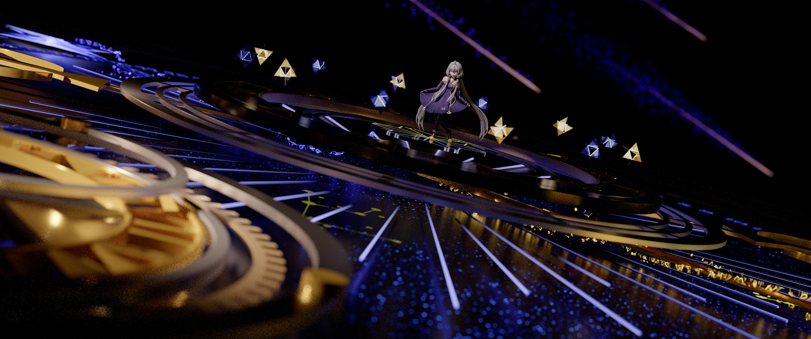
  <br>
  <em>Stardust</em>
</p>

This is my own Blender scene (8.8 M triangles, 2.4 M emissive, light linking). 3440x1440, 2048 spp, DEPTH 12, AgX, no denoising, 33.4 s on RTX 3090 (16.3 ms/sample).

<p align="center">
  
  <br>
  <em>Sponza</em>
</p>

Intel Sponza with the curtains package, 1920x1080, 1024 spp, DEPTH 8, AgX punchy, no denoising, 12.5 s on RTX 3090 (12.2 ms/sample).

## Features

**Rendering**
- [Wavefront path tracer](#rendering-pipeline) on OptiX hardware ray tracing
- [glTF scenes and meshes](#meshes-gltf-loading) with textures and normal maps
- [glTF metallic-roughness materials](#materials-gltf-metallic-roughness): transmission, volume absorption, clearcoat, specular, alpha mask and blend
- [Next event estimation with MIS](#nee-and-mis) over emissive meshes and point, spot and directional lights
- [Blender light linking](#light-linking-and-spot-lights)
- [Importance-sampled environment maps](#environment-map-sampling) with MIS compensation
- [Thin lens depth of field](#depth-of-field) and [stochastic antialiasing](#antialiasing)
- [AgX and ACES view transforms](#view-transform)
- Physically Based Camera and Lens System: under work right now.

**Performance**
- [Stream compaction inside the shade kernel](#compaction-moved-into-the-shade-kernel) with warp-aggregated atomics
- [Material sorting](#material-sort) with a CUB radix sort (optional)
- [Russian roulette](#russian-roulette)
- [Device link-time optimization](#device-link-time-optimization)

**Other**
- [Unreal-style viewport camera](#viewport-controls) and scene switching in ImGui
- [Headless rendering](#headless-rendering) from the command line

## Rendering pipeline

The renderer is a wavefront path tracer: each stage of a bounce is one launch over every live path, and paths that end are compacted away. Intersection runs on OptiX hardware ray tracing.


Each bounce is one OptiX launch and one CUDA kernel. The launch traces the live paths to their closest hit and, in the same launch, the shadow rays the previous bounce queued, which saves a launch per bounce. `shadeMaterial` then adds emitted light weighted by MIS, queues a shadow ray toward a picked light, runs Russian roulette, samples the next direction, and writes the surviving paths straight into the next bounce's buffer with warp-aggregated atomics ([stream compaction](#compaction-moved-into-the-shade-kernel)). The dashed box is the material sort (`--sort`), off by default since it slows most scenes down.

## Rendering features

### Meshes: glTF loading

glTF and glb files load through [tinygltf](https://github.com/syoyo/tinygltf) (v2.9.7), either as the whole scene or as a `"TYPE":"mesh"` object in a scene JSON. Normal-mapped meshes without tangents get them from [MikkTSpace](https://github.com/mmikk/MikkTSpace) (Morten S. Mikkelsen, zlib license, vendored in `external/mikktspace/`). Textures are CUDA texture objects that decode sRGB in hardware; a texture that is missing renders magenta in the base color slot, so a broken asset shows in the render.

OptiX builds one triangle GAS per glTF primitive and one IAS over the instances. `--no-optix` falls back to the naive kernel, which tests every triangle and renders without NEE.

#### Naive loop vs OptiX by triangle count

1024x1024, ms per sample, median of 3 runs.

| scene | triangles | depth | naive | OptiX |
|---|---|---|---|---|
| cornell (spheres and cubes, no mesh) | 0 | 8 | 8.41 | 8.63 |
| cornell-box (research scene) | 36 | 66 | 11.56 | 11.43 |
| cornell_helmet | 15,452 | 8 | 320 | 8.42 |
| transmission_roughness | 77,792 | 12 | 1,511 | 7.37 |
| dragon_attenuation | 134,995 | 16 | 3,146 | 7.52 |
| sponza | 262,267 | 8 | 5,553 | 10.20 |


The naive kernel's time grows linearly with the triangle count, about 20 ms per sample per thousand triangles, because every path tests every triangle at every bounce. OptiX stays within 15% of the Cornell frame time up to Sponza, and takes 12.7 ms on Intel Sponza (5.7 M triangles).

### Materials: glTF metallic-roughness

Materials in this renderer take glTF 2.0's metallic-roughness parameters and is shaded with the reference BRDF from Appendix B of the spec, extended to a BSDF by KHR_materials_transmission, volume, ior, specular, clearcoat and emissive_strength. Normal maps, alpha masks and alpha blending (as stochastic coverage) are supported. I chose to treat transmission as a solid boundary rather than glTF's thin-walled default, since better fits Blender's export without the `KHR_materials_volume` extension

The three Khronos material tests ship without lights, so I added a light panel to the scene files. Rendered at 1024 spp, AgX.

| TransmissionRoughnessTest, 1280x640 | DragonAttenuation, 1280x720 |
|:---:|:---:|
|  |  |
| **ClearCoatTest, 800x1000** | **DamagedHelmet, 800x800** |
|  |  |

- **TransmissionRoughnessTest**: ior from 1.0 (top) to 2.42, roughness growing to the right. The ior 1.0 row stays sharp, since nothing bends a ray there.
- **DragonAttenuation**: one absorption color and distance; the thin tail come out with fainter yellow and the thick body deep orange.
- **ClearCoatTest**: the base layer's broad highlight (left), the coat's sharp one (right), and both (middle).
- **DamagedHelmet**: normal, metallic-roughness and emissive maps.

### NEE and MIS

Every hit except a path's last picks a point on a light and queues a shadow ray toward it. Multiple importance sampling weighs that light sample against BSDF-sampled rays that hit the same emitter, with the power heuristic (Veach 1997). Lights are picked in proportion to their power: emissive triangles, point, spot and directional lights from `KHR_lights_punctual`, and the [environment map](#environment-map-sampling). With enough samples NEE + MIS and BSDF sampling alone converge to the same mean, within 0.1% on eight test scenes. `--no-nee` and a checkbox in the viewport panel turn it off.

Veach MIS, 1024x1024, 64 spp, AgX, OptiX.

| BSDF sampling only | NEE + MIS |
|:---:|:---:|
|  |  |

- **Noise**: the RMSE against a 4096 spp render drops from 62.8 to 9.1 (of 255), 48x less variance.
- **Frame time**: 2.34 ms/spp with NEE against 1.46 without.

#### Emissive textures in the light power

A emissive triangle's pick weight is its emission factor times its emissive texture's average (how PBRT-v4 weighs an image area light). DamagedHelmet is a really good example model with emission texture, as it has many triangles with emission factor 1, but most of the emission texture is black. Before this accouting for texture's average, the emissive triangles drew 63% of the light picks, and nearly all of them returned nothing. With the texture's average it now draws 0.3%.

`cornell_helmet`, 1024x1024, 64 spp, AgX. Bottom row: the floor in front of the helmet at 2x.

| Before: emission factor only | After: factor x texture average |
|:---:|:---:|
|  |  |
|  |  |

- **Noise**: RMSE against 4096 spp drops from 12.9 to 9.2 (of 255), about what twice the samples would give.
- **Frame time**: 3.0 against 2.9 ms/spp.

#### Light linking and spot lights

Blender's light linking lets a light illuminate only the objects in a receiver collection, and Stardust depends on it. The export script writes each light's link group and each object's receiver mask into the glTF as node extras, following Cycles' rule. A light sample is dropped when the receiver is not linked to the picked light, and so is the emission a BSDF ray finds on an emitter its surface is not linked to, so the MIS weights still add up to 1. The light picks use one table per distinct receiver mask in the scene, so a surface only picks lights that can reach it ([why](#light-linking-with-one-pick-table-speckled-the-character)).

Spot lights are the remaining `KHR_lights_punctual` type, with Cycles' cone blend mapped onto glTF's inner and outer angles. The soft shadow radius of a Blender spot is not supported yet.

### Environment map sampling

With the environment found by BSDF sampling alone, a diffuse surface under a sunset HDRI hits the sun by luck, which is the grain in the left column below. The environment is one of the lights NEE picks, drawn from a 2D table over the map's luminance and weighed against BSDF sampling with MIS. MIS compensation (Karlík et al. 2019) subtracts the map's average before the table is built, so the picks go to the sun and the bright patches, and BSDF sampling covers the even part of the sky.

`hdri_helmet` under `venice_sunset_4k.hdr`, 1024x576, 64 spp, AgX. Bottom row: the floor in front of the diffuse sphere at 2x.

| Environment by BSDF sampling | Environment NEE + MIS | With MIS compensation |
|:---:|:---:|:---:|
|  |  |  |
|  |  |  |

- **Noise**: RMSE against 4096 spp 4.34, 2.85 and 2.69 (of 255).
- **Frame time**: 1.11, 1.55 and 1.37 ms/spp.
- The specks left on the floor are the sun reflected by the chrome sphere, a caustic no light sample reaches.

living-room, lit by its sky map alone, 1024x576, 256 spp, AgX. Bottom row: the ceiling and wall above the right windows at 2x.

| Environment by BSDF sampling | Environment NEE + MIS | With MIS compensation |
|:---:|:---:|:---:|
|  |  |  |
|  |  |  |

- **Noise**: RMSE against 2048 spp 24.5, 16.1 and 14.9.
- **Frame time**: 4.34, 7.42 and 6.85 ms/spp. Most environment shadow rays from inside a room end on a wall.

### Antialiasing

Every sample sends a pixel's camera ray through a random point in the pixel instead of its center, so edges and textures average over the pixel as the samples accumulate. There are no mipmaps, so this jitter is also the only texture filtering: without it, fine texture detail aliases into speckle. `--no-aa` sends every ray through the pixel center for comparison. The jitter costs nothing measurable, 7.81 ms/spp either way.

Intel Sponza, 1024x1024, 1024 spp, AgX punchy. 128x128 crops at 4x:

| No antialiasing | Antialiasing |
|:---:|:---:|
| 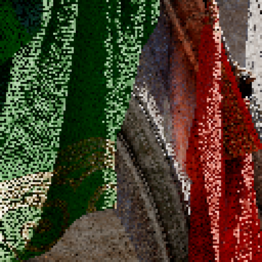 | 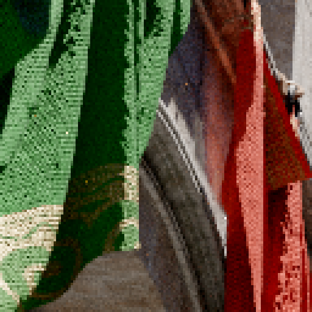 |
| 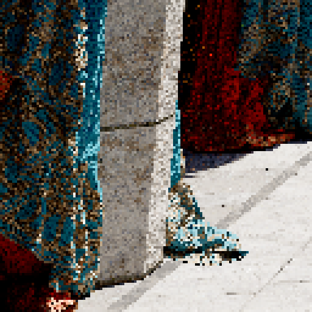 | 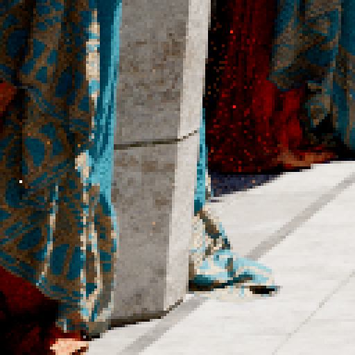 |

### Depth of field

The thin lens camera starts each ray at a random point on a disk of radius `APERTURE` and aims it at the point where the pinhole ray crosses the plane at `FOCUS`, so that plane stays sharp and everything off it blurs with distance. Stardust's aperture comes from the Blender camera's focal length and f-stop (radius = focal length / 2N); the render below opens it to 0.15 from the cover's 0.0625. `--lens`, `--aperture` and `--focus` override the scene file. The thin lens costs 8.36 against 8.06 ms/spp for the pinhole.

Stardust, 2580x1080, 2048 spp, DEPTH 12, AgX. Bottom row: the foreground gear at 1x.

| Pinhole | Thin lens, aperture 0.15 |
|:---:|:---:|
| 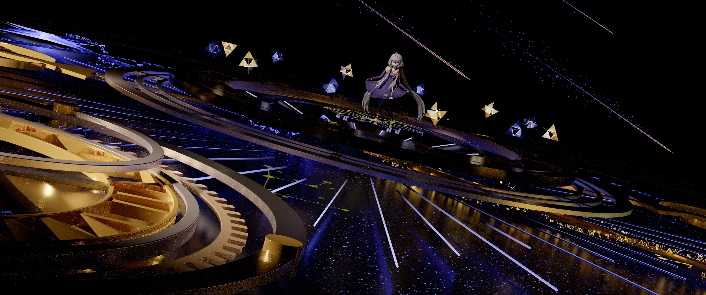 | 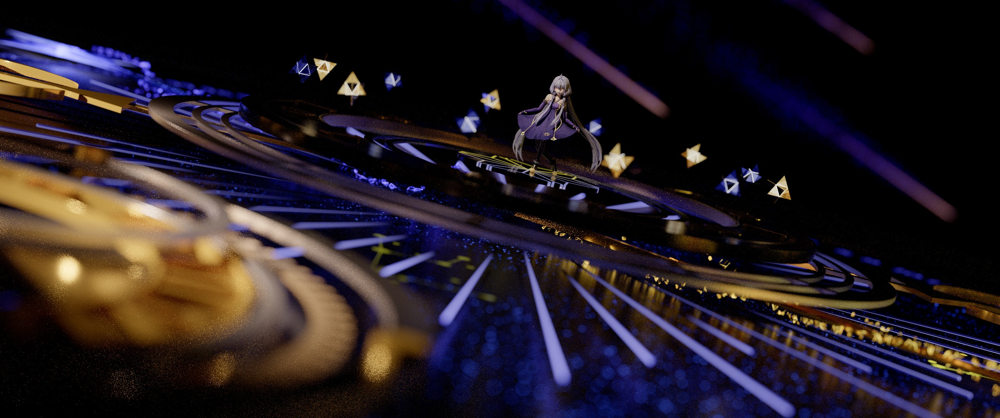 |
| 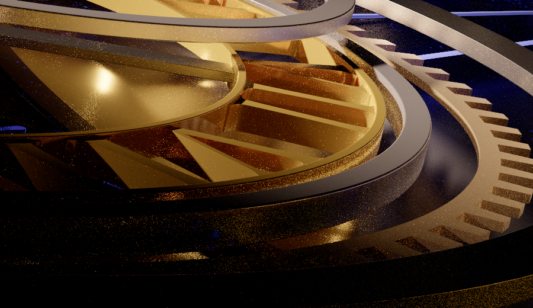 | 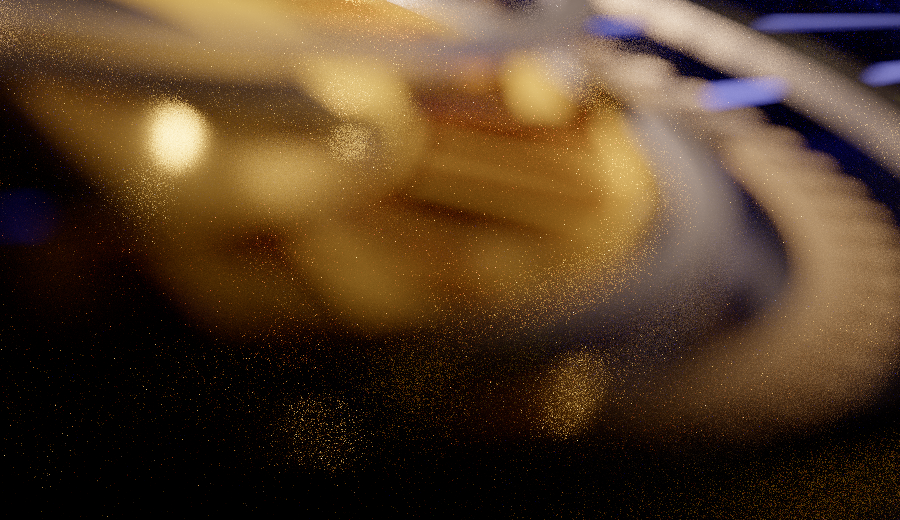 |

### View transform

The accumulation buffer stays scene-linear, and the view transform runs at display and at save through the same function, so the viewport and the PNG agree. The default is AgX punchy, from Benjamin Wrensch's [Minimal AgX Implementation](https://iolite-engine.com/blog_posts/minimal_agx_implementation) of Troy Sobotka's [AgX](https://github.com/sobotka/AgX). ACES comes in Krzysztof Narkowicz's [fit](https://knarkowicz.wordpress.com/2016/01/06/aces-filmic-tone-mapping-curve/) and Stephen Hill's (from MJP's [BakingLab](https://github.com/TheRealMJP/BakingLab/blob/master/BakingLab/ACES.hlsl)).

Glass Cornell, 600x600, 1000 spp, exposure 1.0, DEPTH 8:

<!-- TODO: replace these four with the final hero shot through the same four transforms. Cornell has no saturated highlights, so the hue-skew difference between ACES and AgX barely shows here. -->

| ACES, Narkowicz fit | ACES, Hill fit (1/0.6) |
|:---:|:---:|
|  |  |
| **AgX** | **AgX punchy** |
|  |  |

## Performance

### Device link-time optimization

The base code builds with `CUDA_SEPARABLE_COMPILATION ON`, and without device link-time optimization a `__device__` function from another file cannot be inlined. `cuobjdump --dump-sass` showed `boxIntersectionTest`, `sphereIntersectionTest` and `scatterRay` as real calls inside the kernels, with their arguments going through local memory.


Release builds now add `-dlto` to the CUDA compile and device link options. The frame got 25 to 40% faster depending on resolution, but costs about 4 s of extra device link time per build.

### Compaction and sort: thrust to CUB with device LTO

At first this renderer used `thrust::stable_partition` for compaction and `thrust::sort_by_key` for the material sort. With the sort on, a 400x400 sample took 13 ms, and timing each stage showed majority of the frame time going to sorting.

| stage | generate | intersect | sort | shade | compact | gather |
|---|---|---|---|---|---|---|
| ms | 0.08 | 0.36 | 8.9 | 0.21 | 4.0 | 0.03 |

This is due to every thrust call under `thrust::device` allocates scratch memory with `cudaMalloc` and frees it with `cudaFree`, which waits for all outstanding GPU work, and `sort_by_key` over a zip iterator copied every path through four radix passes. A caching allocator alone removed 60 to 70% of both stages. The CUB version removes the rest of the overhead by allocating its workspace once, drops ended paths instead of partitioning them to the back, and sorts (material key, path index) pairs over only the bits the material count needs before one gather.

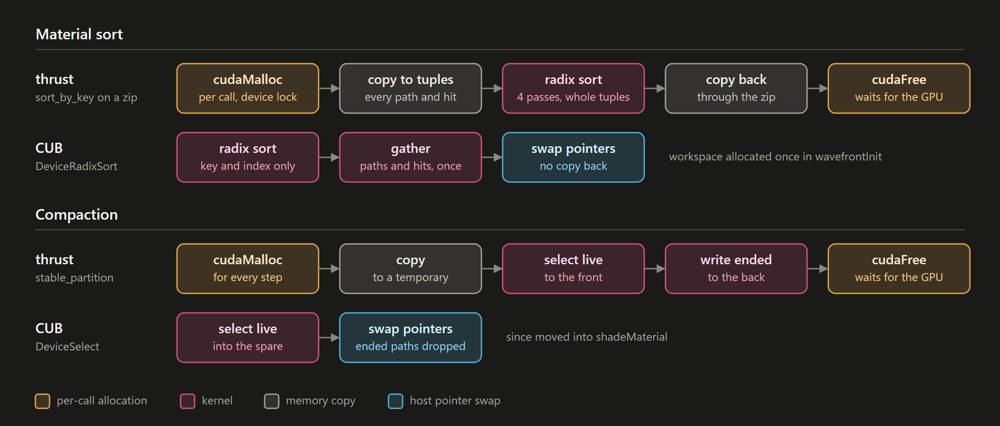

Buffer ownership over three bounces. Each bar is a whole buffer, filled to the share of paths alive.

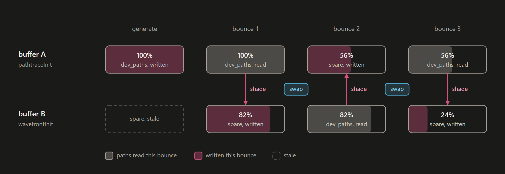

Cornell, median of 5 runs, ms per sample.


At 1024x1024 the frame went from 22.90 to 2.07 ms per sample, 11x. Device LTO is 1.6x of that on its own.

### Compaction moved into the shade kernel

**Motivation:** In a Nsight Systems profile on Cornell at 1024x1024, the CUB compaction took 0.49 ms of a 2.59 ms sample (19%; 6% on Intel Sponza). It reads every path `shadeMaterial` has just written, writes the live ones a second time, and adds two launches per bounce.

**How it works** is a warp-aggregated atomics. `shadeMaterial` writes the surviving paths straight into the spare buffer. The warp votes with `__ballot_sync`, lane 0 reserves room for the warp's survivors with one `atomicAdd`, and each survivor writes to that base plus its rank among the survivors (`__popc`), so the stores stay coalesced.

1024x1024, 100 spp, median of 5 runs, ms per sample.


- **Compaction kernels**: gone, 0.49 ms.
- **`shadeMaterial`**: 0.67 to 0.54 ms, since it writes only the survivors (18 to 50% of the paths had ended by bounces 1 to 3). By bytes alone that is about 0.05 ms; I have not looked into where the rest comes from.
- **Idle time**: 0.10 ms less, from the launch gaps that went with the compaction kernels.

Keeping the survivor count on the GPU instead of reading it back each bounce gained only 0.07 ms on Cornell and 0.1 to 0.2 ms on Intel Sponza, at the cost of queuing whole samples ahead of the GPU and losing per-bounce error checks, so I left it out.

### Paths alive per bounce

Three scenes with the same DamagedHelmet, from open to closed, at 1024x1024 and DEPTH 8: the helmet on a plane under an HDRI (`helmet_plane.json`), the stock Cornell box with its front open (`cornell_helmet.json`), and a closed box with a sixth wall behind the camera (`cornell_closed.json`), where a path ends only on the light, by Russian roulette or at DEPTH.

| Helmet on plane | Cornell box, front open | Closed Cornell box |
|:---:|:---:|:---:|
| 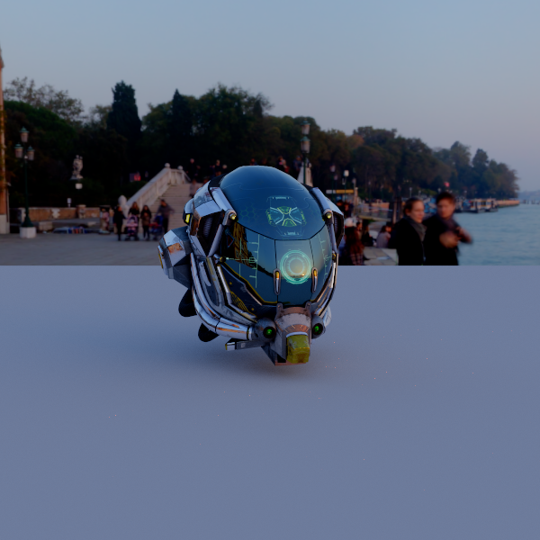 | 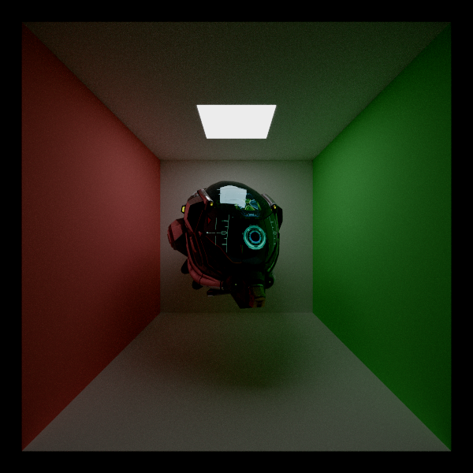 | 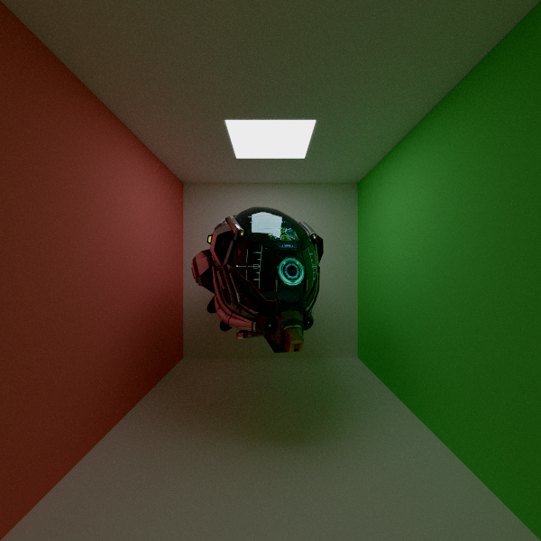 |

Paths alive entering each bounce, from `--timing`:

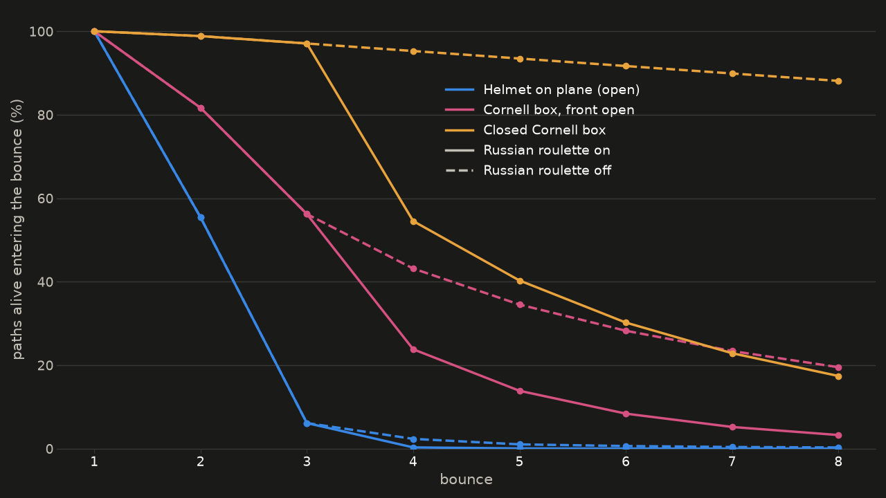

- **Helmet on plane**: 44.6% of the paths see the sky at the first bounce, and most rays off the plane go up to the sky too, so only 6.1% are left by bounce 3 and Russian roulette has almost nothing to kill.
- **Cornell box, front open**: without Russian roulette about a fifth of the paths end per bounce, out of the open front or on the light. With it, 58% of the rest end at bounce 3 and about 40% per bounce after.
- **Closed Cornell box**: only 1 to 2% end per bounce, and without Russian roulette 88% are still alive at bounce 8.

### Open and closed scenes

`--no-compact` turns compaction off: every bounce launches over all 1,048,576 paths, and the kernels return early on a path that ended. Both modes render the same image.

Headless, 1024x1024, 100 spp, median of 5 alternated runs, ms per sample:

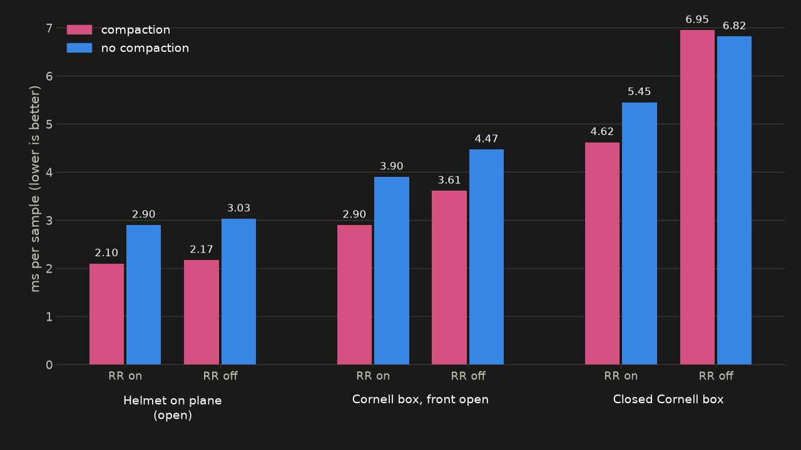

Time per bounce with Russian roulette, median of 5 `--timing` runs:

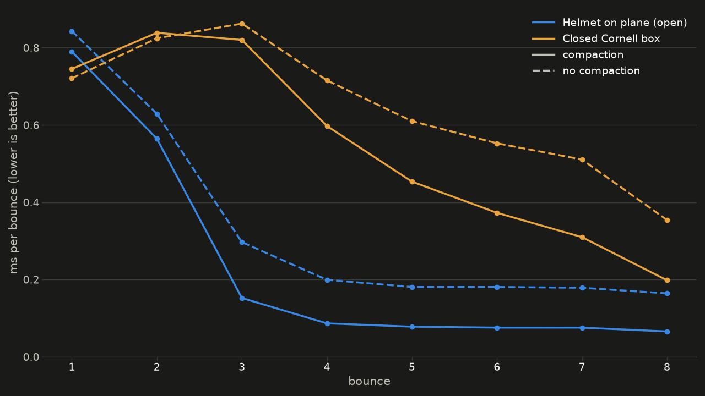

- **Open scenes**: compaction saves 28% on the helmet plane and 26% in the open Cornell box. Once most paths are gone, a compacted bounce costs about 0.08 ms (the launches and the count readback), against about 0.18 ms for a full-width launch whose threads load their path and return.
- **Closed box**: compaction saves 15%, only as much as Russian roulette removes. Without the roulette it is 2% slower, since it drops almost nothing and still pays for the warp vote and the atomic.
- **Russian roulette**: saves 34% in the closed box and 3% on the helmet plane, where few paths live long enough to roll.
- **Bounce 2 costs more than bounce 1** in the closed box with nearly every path alive: camera rays leave in neighboring directions and diffuse bounce rays do not, so their traversal is less coherent.

### Russian roulette

From the third bounce, a path survives with a probability equal to its throughput's luminance (at most 0.95), and a survivor's throughput is divided by that probability, which keeps the estimate unbiased. `--no-rr` turns it off.

Headless, median of 3 interleaved runs, ms per sample.

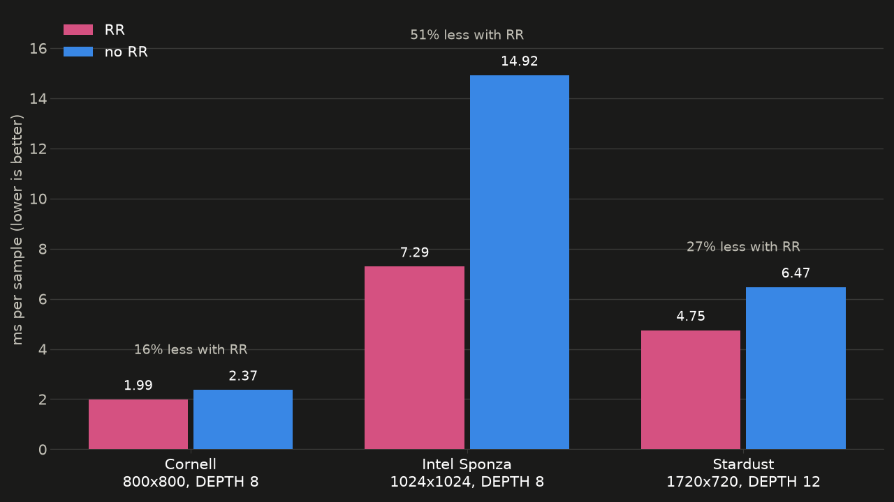

- **Paths ended at the third bounce**: 96% in Sponza with RR, against 17% without it. Two bounces off its dark stone leave a path a few percent of its throughput, so most paths lose the roll.
- **Noise**: at 512x512 and 256 spp, the RMSE against an 8192 spp render without RR is 11.12 against 10.81 (of 255) in Sponza, and 4.94 against 4.23 in Cornell. Per unit of time that makes RR about 1.6x as efficient in Sponza, but only about 0.85x in Cornell. My guess is that Cornell's white walls leave the paths RR ends with much of their throughput, so the variance it adds outweighs the 16% it saves.

### Material sort

`--sort` radix-sorts the paths by the material they hit and gathers them into that order before shading, so the threads of a `shadeMaterial` warp read the same material. It is off by default due to having worse performance. 

Headless, 1024x1024 (Stardust 1720x720), 100 spp, ms per sample by stage from one `--timing` run per bar:

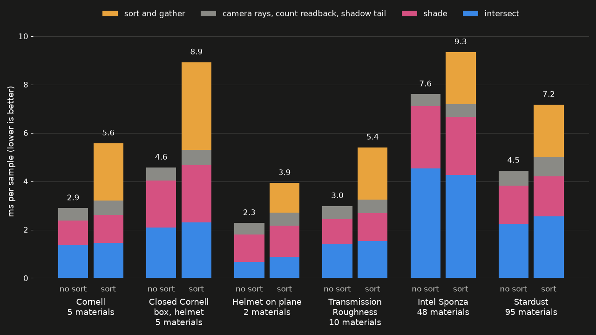

The sort makes every scene 1.2x (Sponza) to 1.9x (Cornell) slower, all of it in the sort stage. `shadeMaterial` itself changes by at most 0.45 ms, and only Sponza, with 48 materials, gets faster; the scenes with a handful of materials get slightly slower. Every material goes through the same `scatterPbr`, and the lobe a path samples is a random choice per path, sorted or not, so there is little divergence for the sort to remove, however many materials there are. My guess is that Sponza gains its bit because sorted warps fetch the same textures; I have not profiled it.

#### Why is my sort so slow???

With Nsight Compute, looking into `gatherByIndex` kernel of the with glm 0.9.6 build, the SASS shows that compiler turns every with warp stall sampling: every `pathsOut[i] = pathsIn[src]` into 3 pairs of load and stores that depends on the load.

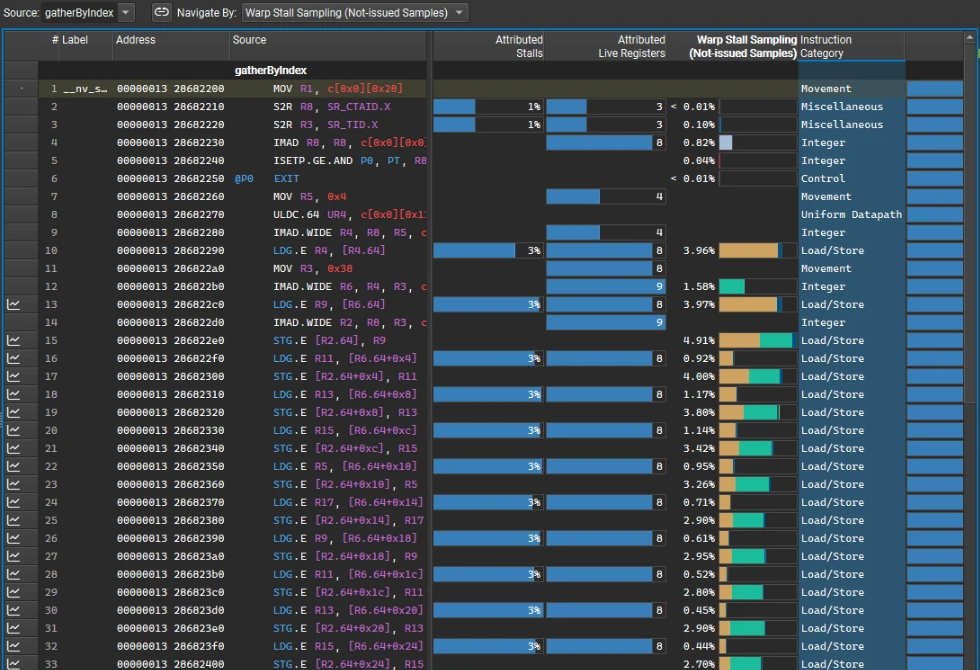

This is because the base code's glm 0.9.6 writes the vectors' `operator=` by hand, which makes every struct holding a `glm::vec3` not trivially copyable, and the compiler cannot reorder the load and stores because it doesn't know if the two `PathSegment*` pointers are overlapping or not, thus it needs to keep the original order.

Data from Nsight Compute, `gatherByIndex` kernel, before and after the glm upgrade.

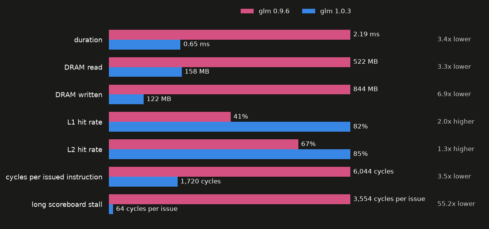

Upgrading glm to 1.0.3, whose `operator=` is `= default`, makes the structs trivially copyable again and the gather compiles to 29 loads followed by 29 stores (`__restrict__` on the pointers gives the same code with the old glm). A `static_assert` next to the kernel keeps it that way.

Headless, 1024x1024 (Stardust 1720x720), 100 spp, the sort stage per sample from one `--timing` run per bar:

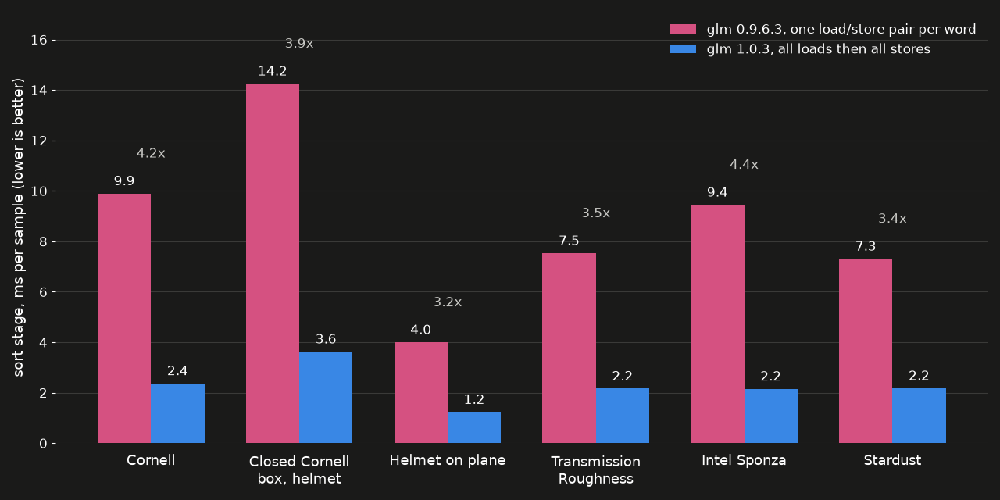

What is left is the move itself: after the sort, a warp's 32 lanes read 32 structs at least 56 bytes apart, so every load touches 32 sectors for 128 useful bytes, about three times the cost of a contiguous copy. That is more than the shade kernel gains, so the sort stays off.

#### Why sorting cannot win here

Two things cap what the sort can give back.
1. All the sort can do is remove divergence from the shade stage, but sorting literally costs more than shading itself. Even removing every bit of divergence would not cover.
2. `materialID` is not what the warps diverge on. `shadeMaterial` branches on miss or hit, but miss gets removed a stage later by compaction anyways. Then inside `scatterPbr`, warps diverges on which lobe to sample: clearcoat, metal, glass, etc. Every one of those picks compares a random number against a material parameter. Even for materials no mixing like roughness 0, metallic 1, the `specularFactor` still introduces divergence to mix between clearcoat and diffuse base by Fresnel fraction. 

 What `materialID` sorting does win is texture sampling, which is presumably why on texture heavy scenes like Sponza and Stardust it gets back a tiny bit performance in shading.

Unless materials evaluations gets very complicated (like complex shading graphs in Blender), I don't think material sorting will ever be worth it in this pathtracer.

## Issues/Bloopers along the way

### Light linking with one pick table speckled the character

The first version of light linking kept the one global pick table and dropped the samples whose receiver was not linked to the picked light. In Stardust a very bright light is linked away from the character, while a much dimmer spot lights it, so 99% of the character's light picks were discarded. The few picks of the spot each carried its full contribution divided by a tiny probability, hence the bright specks. The [per-mask pick tables](#light-linking-and-spot-lights) give the bright light a probability of 0 in the character's table, and the same 2048 spp render is clean.

Character crop at 1x, 2048 spp:

| One global pick table | One table per receiver mask |
|:---:|:---:|
| 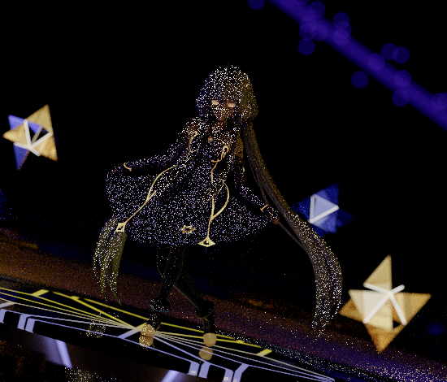 | 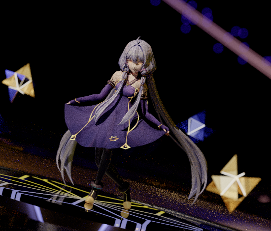 |

### Sponza's dirt decals rendered as solid walls

Intel Sponza's walls carry a `dirt_decal` material with `alphaMode: BLEND`, which the loader treated as opaque, so the dark grime texture covered the walls. A BLEND hit now counts with probability alpha, from a hash of the pixel, iteration, depth and triangle, so both intersection paths make the same decision.


| BLEND as opaque | BLEND as coverage |
|:---:|:---:|
|  |  |

### glm 1.0 compiled to garbage on the device

The first build with glm 1.0.3 ([why it was upgraded](#why-is-my-sort-so-slow)) rendered every scene black, with every path ending on the first bounce on both intersection paths. glm 1.0 routes vector arithmetic through `std::plus`, `std::multiplies` and friends, constexpr host functions, and nvcc 13.3 will not call those from device code unless `--expt-relaxed-constexpr` is set. Instead of an error it prints warning #20013 per instantiation and compiles the call to nothing: on the GPU, `glm::vec3(1, 2, 3) * 2.f` came back as `(1, 2, 0)` and `glm::dot` as NaN, so every camera ray missed. The flag is now on every nvcc command, including the OptiX IR one. Renders after the upgrade differ from the old ones by float drift only: single pixels off by one count, and a few fireflies that moved because a branch flipped on the last bit.

| glm 1.0.3 without the flag | with `--expt-relaxed-constexpr` |
|:---:|:---:|
|  | 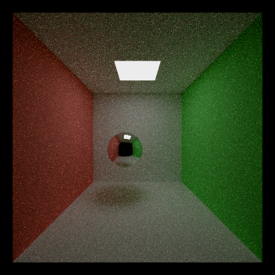 |

### Schlick used the wrong cosine on exit

Schlick's approximation needs the cosine on the air side of the interface, which for a ray leaving glass is the transmitted angle. The base code used the incident one, so reflectance did not reach 100% until 90° instead of the critical angle (about 42° for IOR 1.5), and exit rays just below critical leaked out instead of reflecting back inside. The fix uses the transmitted cosine and treats `k < 0` as total internal reflection.

1000x1000, 500 spp, DEPTH 8, cropped to the sphere:

| Before | After |
|:---:|:---:|
|  |  |

Pixel difference, amplified 8x:


The fixed image is slightly darker at the rim: that light now stays inside for more bounces, and at depth 8 some of those paths hit the cap. Interestingly raising DEPTH to 32 brightens the sphere up by a decent amount, far more than the bug's influence, so glass just needs a much higher depth than diffuse.

### The OptiX cube kept the outward normal on exit hits

The OptiX cube hit program returned the face's outward normal on exit hits, where the naive `boxIntersectionTest` returns the normal facing the ray. Nothing in Cornell starts a ray inside a cube, so it only showed once a glass cube came out dark under OptiX. One sign flip on the inside branch fixed it.

600x600, 1000 spp, DEPTH 8, AgX, OptiX:

| Outward normal on exit | Normal facing the ray |
|:---:|:---:|
|  |  |

### Smaller base code fixes

- **Every camera move freed and reallocated all device buffers.** Buffers are now allocated once; a camera change clears the image.
- **The accumulation buffer was copied to the host every iteration** so the S key could save at any time. The copy now happens inside save.
- **A CUDA error waited on `getchar()` before exiting**, which hangs a headless run. Removed.

## Usage

### Viewport controls

The viewport navigates like the Unreal Engine 5 level editor: hold the right mouse button to look around and fly, or hold Alt for the Maya-style orbit. Any camera move restarts the accumulation.

| Input | Action |
|---|---|
| RMB drag | Look around in place |
| RMB + W / S | Fly forward / back |
| RMB + A / D | Fly left / right |
| RMB + E / Q | Fly up / down along world +Y |
| RMB + wheel | Fly speed up / down, x1.25 per notch (shown in the ImGui panel) |
| LMB drag | Up / down moves along the ground, left / right turns |
| MMB drag, or LMB + RMB drag | Pan |
| Wheel | Move forward / back in steps |
| Alt + LMB drag | Orbit around the pivot |
| Alt + RMB drag | Move toward / away from the pivot |
| Alt + MMB drag | Pan |
| F | Back to the scene file's camera |
| Ctrl + S | Save the image |
| Esc | Save the image and quit |

The ImGui panel also switches scenes without a restart.

### Headless rendering

```
./build/bin/Release/cis565_path_tracer.exe scenes/cornell.json --headless --spp 100 --res 400x400 --out img/test/cornell.png
```

`--spp`, `--res`, `--depth` and `--out` override the scene file, and also work in windowed mode. The comparisons above use `--no-nee`, `--no-optix`, `--sort`, `--no-compact`, `--no-rr`, `--no-aa`, `--lens`, `--aperture`, `--focus` and `--tonemap none|aces|agx|agx-punchy`; `--list` prints the scene names. An `.exr` output keeps the scene-linear average as float32.

### Building

Built and tested with Windows 11, Visual Studio 2022 (MSVC), CUDA 13.3, CMake 4.4 and NVIDIA driver 617.14.

```
cmake -S . -B build -G "Visual Studio 17 2022" -A x64
cmake --build build --config Release
```

The OptiX 9.1.0 headers are vendored in `external/include/optix` and the implementation ships with the driver, so no OptiX SDK install is needed. OptiX needs a Turing or newer GPU (the programs are compiled for `sm_75`); without it the renderer falls back to the naive kernel, without NEE.

#### CMakeLists.txt changes

Besides the source lists:

- **C language enabled** in `project()`, for MikkTSpace's `mikktspace.c`.
- **`/Zc:preprocessor`** on MSVC builds: CUDA 13's Thrust and CUB headers do not compile with MSVC's traditional preprocessor.
- **OptiX include path** `external/include/optix`. Nothing is linked, since the implementation is in the driver.
- **OptiX programs as embedded IR**: a custom command compiles `src/optix/optix_programs.cu` with `nvcc -optix-ir`, and `cmake/EmbedFile.cmake` (new) embeds the IR in the executable.
- **Device LTO**: Release builds add `-dlto` to the CUDA compile and device link options ([why](#device-link-time-optimization)).
- **`GLM_FORCE_CTOR_INIT`** for every language, so glm 1.0 keeps zeroing default-constructed vectors the way the base code's 0.9.6 did.
- **`--expt-relaxed-constexpr`** on every nvcc command, the OptiX IR one included: without it glm 1.0's device arithmetic silently compiles to garbage ([why](#glm-10-compiled-to-garbage-on-the-device)).
- **`src/` split by role** into `app/`, `scene/`, `render/` and `optix/`, with `src/` as the include root.
- **Two test executables**, `bsdf_test` and `lens_test`, left out of the default build.

## Credits

### Test assets

`scenes/assets/` is gitignored, so the models below are downloaded into it from the [Khronos glTF-Sample-Assets](https://github.com/KhronosGroup/glTF-Sample-Assets), the [Intel Sample Library](https://www.intel.com/content/www/us/en/developer/topic-technology/graphics-processing-research/samples.html) and [NVIDIA's Open Research Content Archive](http://developer.nvidia.com/orca/amazon-lumberyard-bistro).

| model | triangles | scene file | credit |
|---|---|---|---|
| Box | 12 | `cornell_boxmesh.json` | Cesium, 2017, CC BY 4.0 |
| Duck | 4,212 | `cornell_duck.json` | Sony, 2006, SCEA Shared Source License 1.0 |
| Suzanne | 3,936 | `cornell_suzanne.json` | Norbert Nopper / UX3D, 2017, CC0 |
| DamagedHelmet | 15,452 | `cornell_helmet.json` | theblueturtle_, 2016, CC BY-NC 4.0; glTF rebuild by ctxwing, 2018, CC BY 4.0 |
| Sponza | 262,267 | `sponza.json` | Crytek (Frank Meinl), CryENGINE Limited License Agreement, glTF conversion from the Khronos repo |
| TransmissionRoughnessTest | 77,792 | `transmission_roughness.json` | Ed Mackey, Analytical Graphics, 2021, CC BY 4.0 |
| DragonAttenuation | 134,995 | `dragon_attenuation.json` | Dragon: Stanford Computer Graphics Laboratory, 1996, converted by Morgan McGuire, 2017, Stanford Graphics Library license; cloth backdrop: Adobe, CC0 |
| ClearCoatTest | 37,116 | `clearcoat.json` | Ed Mackey, Analytical Graphics, 2020, CC BY 4.0 |
| Intel Sponza, main and curtains | 3,747,018 + 1,997,366 | `sponza_intel.json` | Frank Meinl and Anton Kaplanyan, Intel, 2022, CC BY 4.0; curtains add-on by the Sponza Addon Package Crew |
| Bistro exterior | 2,829,226 | `assets/Bistro/Exterior/BistroExterior.gltf`, loaded directly | Amazon Lumberyard, July 2017, CC BY 4.0 |
| Bistro interior | 1,043,077 | `assets/Bistro/Interior/BistroInterior.gltf`, loaded directly | Amazon Lumberyard, July 2017, CC BY 4.0 |

### Third-party code

| library | version | license | used for |
|---|---|---|---|
| [tinygltf](https://github.com/syoyo/tinygltf) | 2.9.7 | MIT | glTF and glb loading |
| [MikkTSpace](https://github.com/mmikk/MikkTSpace) | no releases | zlib | tangents for normal-mapped meshes without them |
| [tinyexr](https://github.com/syoyo/tinyexr) | 1.0.13 | BSD-3-Clause | EXR environment maps and `.exr` output |
| [OptiX](https://developer.nvidia.com/rtx/ray-tracing/optix) | 9.1.0 | NVIDIA OptiX SDK license | hardware ray tracing |
| [stb_image](https://github.com/nothings/stb) | 2.30, updated from the base code's 2.06 | public domain / MIT | texture and HDR loading |
| Thrust and CUB | CUDA 13.3 | Apache 2.0 with LLVM exception | random numbers (Thrust), material sort (CUB) |
| [glm](https://github.com/g-truc/glm) | 1.0.3, updated from the base code's 0.9.6.3 ([why](#why-is-my-sort-so-slow)) | MIT | vectors and matrices everywhere |

GLFW, GLEW, nlohmann/json, Dear ImGui and stb_image_write included in base code.

### References

- Veach 1997: Eric Veach, *Robust Monte Carlo Methods for Light Transport Simulation*, PhD thesis, Stanford University, 1997. 
- Walter et al. 2007: Bruce Walter, Stephen R. Marschner, Hongsong Li, Kenneth E. Torrance, "Microfacet Models for Refraction through Rough Surfaces", Eurographics Symposium on Rendering 2007. The generalized half vector and its Jacobian for rough refraction.
- Dupuy and Benyoub 2023: Jonathan Dupuy, Anis Benyoub, "Sampling Visible GGX Normals with Spherical Caps", High-Performance Graphics 2023.
- Karlík et al. 2019: Ondřej Karlík, Martin Šik, Petr Vévoda, Tomáš Skřivan, Jaroslav Křivánek, "MIS Compensation: Optimizing Sampling Techniques in Multiple Importance Sampling", ACM Transactions on Graphics 38(6), SIGGRAPH Asia 2019.
- PBRT-v4: Matt Pharr, Wenzel Jakob, Greg Humphreys, *Physically Based Rendering: From Theory to Implementation*, 4th edition, MIT Press 2023, https://pbr-book.org.
